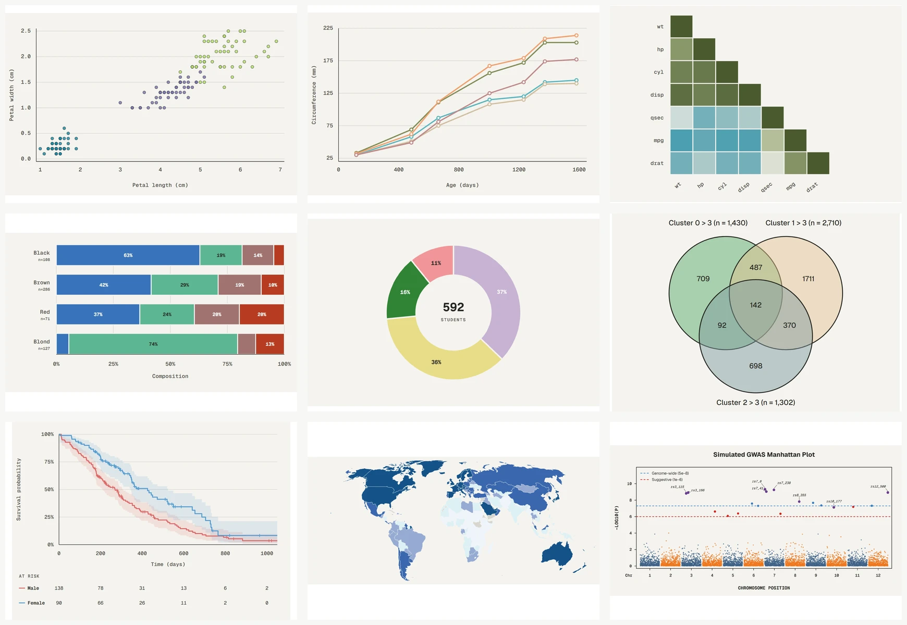
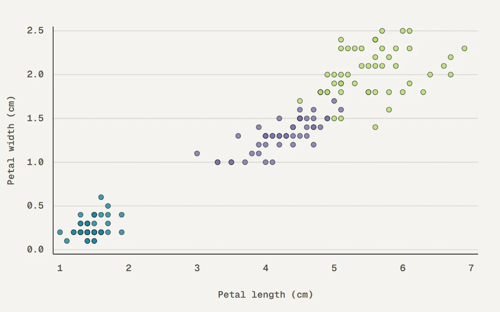
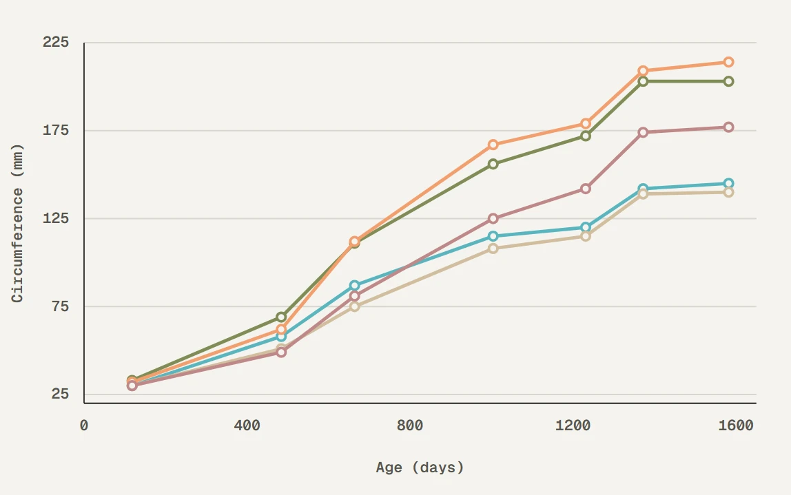
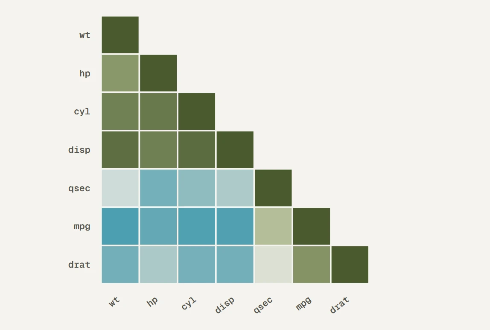
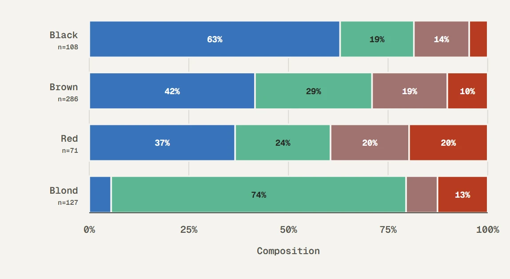
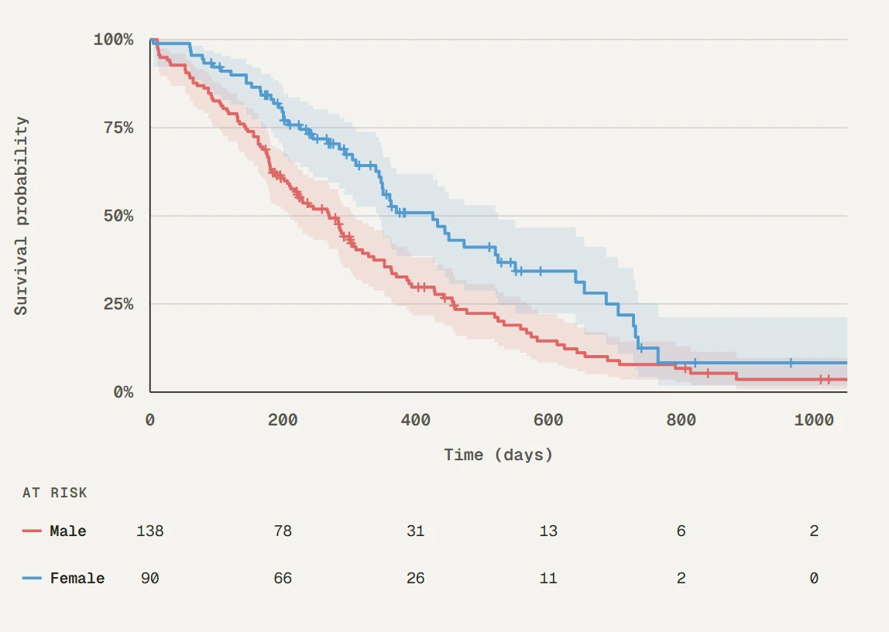
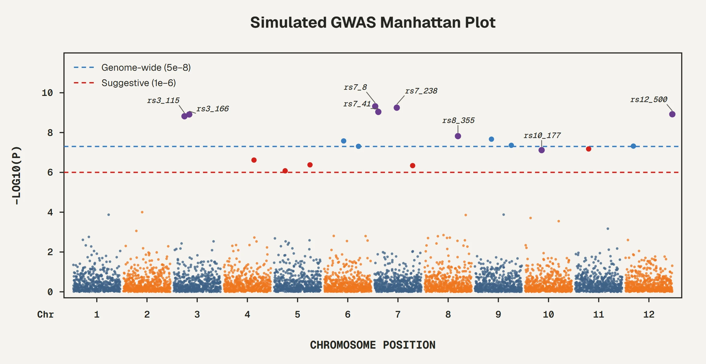

<div align="center">


# biopalette

### *Image-Inspired Color Palettes for Biomedical Visualization*

[](https://CRAN.R-project.org/package=biopalette)
[](https://github.com/evanbio/biopalette/actions/workflows/R-CMD-check.yaml)
[](https://lifecycle.r-lib.org/articles/stages.html#stable)

[📚 Documentation](https://evanbio.github.io/biopalette/) •
[💬 Issues](https://github.com/evanbio/biopalette/issues) •
[🎨 Tessera](https://folio.evanzhou.org/tessera) •
[🧪 Palette Lab](https://folio.evanzhou.org/apps/palette-lab)

---

**Languages:** English | [简体中文](https://github.com/evanbio/biopalette/blob/main/README_zh.md)

</div>

---

> [!NOTE]
> 🎉 **biopalette is on CRAN.** `install.packages("biopalette")` installs the
> current release, 0.2.2.

## Overview

**biopalette** is an R package providing image-inspired color palettes for biomedical visualization.

Every palette begins with a real image — a film still, a scientific figure, an artwork — and is translated into a reproducible color system. The source is always documented: where the colors came from, what they mean, and when to use them.

```r
library(biopalette)

get_palette("babel", n = 5)
get_palette("three_body")
get_palette("walter_white", type = "diverging")

preview_palette("gene_red")
palette_gallery()

# Discrete and continuous ggplot2 scales
scale_color_biopalette("three_body")
scale_fill_biopalette_gradient("mitonuclear_blue")
```

---

## Installation

```r
# Current CRAN release
install.packages("biopalette")

# Development version
remotes::install_github("evanbio/biopalette")
```

**Requires:** R ≥ 4.1.0

---

## Palettes

Each name links to its source page — source image, color table, and intended use.

| Name | Type | Colors | Recommended use | Source |
|---|---|---:|---|---|
| [`gene_red`](https://github.com/evanbio/biopalette/tree/main/palettes/gene_red) | Qualitative | 2 | Emphasized signal versus a dark or neutral counterpart | *Better Call Saul* — Gene Takavic's red coat |
| [`walter_white`](https://github.com/evanbio/biopalette/tree/main/palettes/walter_white) | Diverging | 5 | Signed continuous values around a neutral center | *Breaking Bad* — desert to sky |
| [`walter_white2`](https://github.com/evanbio/biopalette/tree/main/palettes/walter_white2) | Qualitative | 5 | Up to five unordered groups | *Breaking Bad* — muted earth tones |
| [`walter_white3`](https://github.com/evanbio/biopalette/tree/main/palettes/walter_white3) | Diverging | 5 | Warm-register signed continuous values | *Breaking Bad* — warm counterpart |
| [`babel`](https://github.com/evanbio/biopalette/tree/main/palettes/babel) | Qualitative | 21 | Many categorical groups with labels or position support | Pan-cancer myeloid atlas (Cell, 2021) — 22 cell types, 21 voices |
| [`bcell_atlas`](https://github.com/evanbio/biopalette/tree/main/palettes/bcell_atlas) | Qualitative | 7 | Four-to-seven categorical groups with direct labels or position support | Pan-cancer B-cell atlas (Cell, 2024) — graphical abstract |
| [`bcell_atlas2`](https://github.com/evanbio/biopalette/tree/main/palettes/bcell_atlas2) | Diverging | 5 | Signed change between warm and cool biological states | Pan-cancer B-cell atlas (Cell, 2024) — IgA to IgG shift |
| [`bcell_clusters`](https://github.com/evanbio/biopalette/tree/main/palettes/bcell_clusters) | Qualitative | 20 | Many labeled categorical groups with position or faceting support | Pan-cancer B-cell atlas (Cell, 2024) — Figure 1B cluster legend |
| [`three_body`](https://github.com/evanbio/biopalette/tree/main/palettes/three_body) | Qualitative | 3 | Three groups, lineages, or trajectories | Pan-cancer myeloid atlas (Cell, 2021) — three DC trajectories |
| [`mitonuclear_blue`](https://github.com/evanbio/biopalette/tree/main/palettes/mitonuclear_blue) | Sequential | 6 | Cool low-to-high continuous values | Mito-nuclear communication in aging (TIBS, 2022) — young blue |
| [`mitonuclear_orange`](https://github.com/evanbio/biopalette/tree/main/palettes/mitonuclear_orange) | Sequential | 6 | Warm low-to-high continuous values | Mito-nuclear communication in aging (TIBS, 2022) — aged orange |
| [`heat_light`](https://github.com/evanbio/biopalette/tree/main/palettes/heat_light) | Qualitative | 2 | Paired categories or experimental conditions | Bond ampholysis (Nature, 2024) — heat and light turn radicals into an ion pair |
| [`tam_pastel`](https://github.com/evanbio/biopalette/tree/main/palettes/tam_pastel) | Qualitative | 6 | Four-to-six categorical groups on light backgrounds | Pan-cancer myeloid atlas (Cell, 2021) — soft TAM states |
| [`cancer_mosaic`](https://github.com/evanbio/biopalette/tree/main/palettes/cancer_mosaic) | Qualitative | 15 | Ten-to-fifteen categories with labels or position support | Pan-cancer myeloid atlas (Cell, 2021) — cancer-type mosaic |
| [`lactate_steps`](https://github.com/evanbio/biopalette/tree/main/palettes/lactate_steps) | Qualitative | 5 | Five discrete workflow stages or study groups | Lactate metabolism and immunotherapy (JECCR, 2024) — five study stages |
| [`fargo`](https://github.com/evanbio/biopalette/tree/main/palettes/fargo) | Qualitative | 3 | Three groups with a dark anchor and restrained warm accent | *Fargo* — navy, motel-sign teal, and suitcase wine |
| [`immune_circuit`](https://github.com/evanbio/biopalette/tree/main/palettes/immune_circuit) | Qualitative | 8 | Four parent groups with paired states | Chondrosarcoma immune-circuit graphical abstract — paired red, blue, green, and purple |
| [`immune_circuit_red`](https://github.com/evanbio/biopalette/tree/main/palettes/immune_circuit_red) | Sequential | 7 | Increasing tumor burden, cytotoxicity, risk, or damage | Chondrosarcoma immune-circuit graphical abstract — tumor coral |
| [`immune_circuit_green`](https://github.com/evanbio/biopalette/tree/main/palettes/immune_circuit_green) | Sequential | 7 | Increasing immune activation, infiltration, or recovery | Chondrosarcoma immune-circuit graphical abstract — T-cell mint |
| [`lipid_budding`](https://github.com/evanbio/biopalette/tree/main/palettes/lipid_budding) | Qualitative | 4 | Four categorical groups with a balanced cool–warm structure | Hepatic ER lipid-droplet budding — DGAT2, DGAT1, Seipin, and FIT2 |
| [`lipid_budding_blue`](https://github.com/evanbio/biopalette/tree/main/palettes/lipid_budding_blue) | Sequential | 5 | Low-to-high continuous values in muted steel blue | Hepatic ER lipid-droplet budding — DGAT2 blue |
| [`lipid_budding_rose`](https://github.com/evanbio/biopalette/tree/main/palettes/lipid_budding_rose) | Sequential | 5 | Low-to-high continuous values in dusty rose | Hepatic ER lipid-droplet budding — DGAT1 rose |
| [`lipid_budding_orange`](https://github.com/evanbio/biopalette/tree/main/palettes/lipid_budding_orange) | Sequential | 5 | Low-to-high continuous values in salmon orange | Hepatic ER lipid-droplet budding — Seipin orange |
| [`lipid_budding_indigo`](https://github.com/evanbio/biopalette/tree/main/palettes/lipid_budding_indigo) | Sequential | 5 | Low-to-high continuous values in slate indigo | Hepatic ER lipid-droplet budding — FIT2 indigo |
| [`cytokine_sensors`](https://github.com/evanbio/biopalette/tree/main/palettes/cytokine_sensors) | Qualitative | 7 | Six neuroimmune outcomes with a neutral cytokine anchor | Neuronal cytokine sensing in the CNS (Trends Immunology, 2026) |

---

## From Palette to Figure

**biopalette** provides the R interface for retrieving and applying
image-inspired palettes. **[Tessera](https://folio.evanzhou.org/tessera)**
documents their source images, example data, and reproducible R figure
recipes. **[Palette Lab](https://folio.evanzhou.org/apps/palette-lab)** keeps
the data and graphical structure fixed while comparing palette behavior across
17 graphical contexts. The overview and panels below are rendered from Palette
Lab; Tessera links provide the corresponding figure recipes and data context.

<p align="center">
  
</p>

The same palette can behave differently as points, lines, filled regions,
heatmap cells, set overlaps, survival curves, or genome-wide signals. These
examples show the kinds of figures available through the Tessera recipes and
the corresponding palette comparisons in Palette Lab.

<table>
<tr>
<td width="50%" align="center">
  <a href="https://folio.evanzhou.org/tessera/figures/grouped_scatter">
    
  </a><br />
  <sub><b>Grouped scatter</b> · <code>babel</code></sub>
</td>
<td width="50%" align="center">
  <a href="https://folio.evanzhou.org/tessera/figures/multi_line">
    
  </a><br />
  <sub><b>Multi-line comparison</b> · <code>walter_white2</code></sub>
</td>
</tr>
<tr>
<td width="50%" align="center">
  <a href="https://folio.evanzhou.org/tessera/figures/correlation_heatmap">
    
  </a><br />
  <sub><b>Correlation heatmap</b> · <code>walter_white</code></sub>
</td>
<td width="50%" align="center">
  <a href="https://folio.evanzhou.org/tessera/figures/bar">
    
  </a><br />
  <sub><b>Eye color composition by hair color</b> · <code>lactate_steps</code></sub>
</td>
</tr>
<tr>
<td width="50%" align="center">
  <a href="https://folio.evanzhou.org/tessera/figures/survival_curve">
    
  </a><br />
  <sub><b>Kaplan–Meier survival curve</b> · <code>heat_light</code></sub>
</td>
<td width="50%" align="center">
  <a href="https://folio.evanzhou.org/tessera/figures/manhattan">
    
  </a><br />
  <sub><b>Manhattan plot</b> · <code>cancer_mosaic</code></sub>
</td>
</tr>
</table>

---

## Function Reference

<details>
<summary><b>🎨 Palette Access</b> (4)</summary>

- `get_palette()` — retrieve colors by name, type, and size
- `palette_info()` — metadata for one named palette
- `list_palettes()` — data frame of all available palettes
- `palette_gallery()` — paged visual gallery of all palettes

</details>

<details>
<summary><b>🔧 Palette Management</b> (3)</summary>

- `create_palette()` — write a new palette to JSON
- `remove_palette()` — remove a palette by name
- `preview_palette()` — render color swatches to a plot

</details>

<details>
<summary><b>📊 ggplot2 Scales</b> (6)</summary>

- `scale_color_biopalette()` / `scale_colour_biopalette()` — discrete color scales
- `scale_fill_biopalette()` — discrete fill scales
- `scale_color_biopalette_gradient()` / `scale_colour_biopalette_gradient()` — continuous color gradients
- `scale_fill_biopalette_gradient()` — continuous fill gradients

</details>

<details>
<summary><b>🔵 Color Utilities</b> (2)</summary>

- `hex2rgb()` — convert HEX to RGB
- `rgb2hex()` — convert RGB to HEX

</details>

---

## License

MIT License © 2025–2026 [Yibin Zhou](mailto:evanzhou.bio@gmail.com)

<div align="center">

**Made with care by [Yibin Zhou](https://github.com/evanbio)**

</div>
