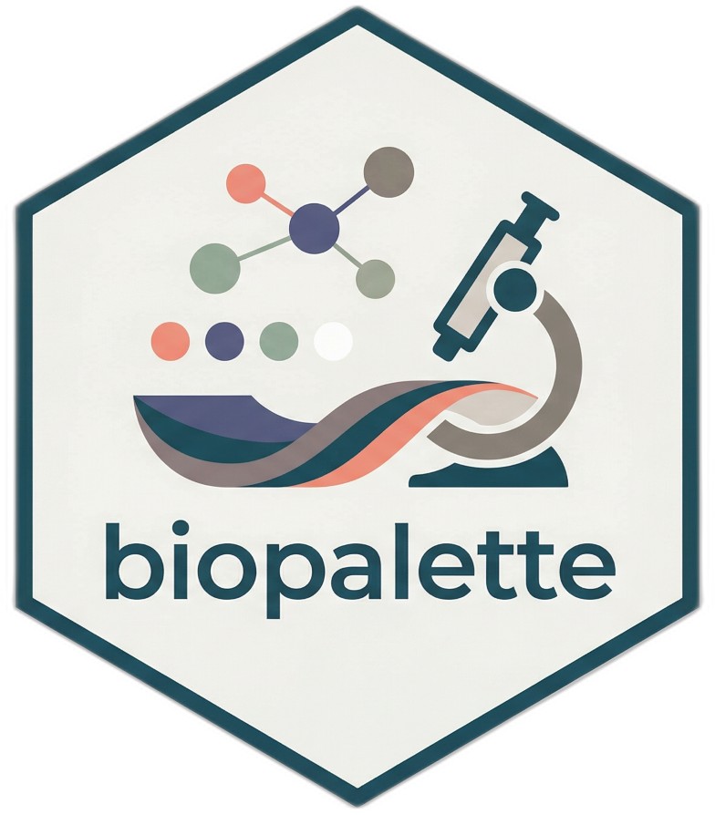

# biopalette



### *面向生物医学可视化的图像驱动配色方案*

[](https://github.com/evanbio/biopalette/actions/workflows/R-CMD-check.yaml)
[](https://lifecycle.r-lib.org/articles/stages.html#experimental)

[📚 文档](https://evanbio.github.io/biopalette/) • [💬
问题反馈](https://github.com/evanbio/biopalette/issues)

------------------------------------------------------------------------

**语言版本:** [English](https://evanbio.github.io/biopalette/README.md)
\| 简体中文

------------------------------------------------------------------------

## 项目简介

**biopalette** 是一个 R
包，提供以图像为来源的故事驱动配色方案，专为生物医学可视化设计。

每一套配色都源自一张真实的图像——电影剧照、科研图表或艺术作品——并转化为可复现的色彩系统。来源始终有据可查：颜色从哪里来、代表什么、适合用在哪里。

``` r
library(biopalette)

get_palette("babel", n = 5)
get_palette("three_body")
get_palette("walter_white", type = "diverging")

preview_palette("gene_red")
palette_gallery()
```

------------------------------------------------------------------------

## 安装

``` r
# 开发版
devtools::install_github("evanbio/biopalette")
```

**系统要求：** R ≥ 4.1.0

------------------------------------------------------------------------

## 配色列表

| 名称            | 类型 | 颜色数 | 来源                                                     |
|-----------------|------|--------|----------------------------------------------------------|
| `gene_red`      | 定性 | 2      | *风骚律师* — Gene Takavic 的红色外套                     |
| `walter_white`  | 发散 | 5      | *绝命毒师* — 荒漠到天空                                  |
| `walter_white2` | 定性 | 5      | *绝命毒师* — 低饱和大地色调                              |
| `walter_white3` | 发散 | 5      | *绝命毒师* — 暖色对应版本                                |
| `babel`         | 定性 | 21     | 泛癌骨髓细胞图谱（Cell, 2021）— 22 种细胞类型，21 种声音 |
| `three_body`    | 定性 | 3      | 泛癌骨髓细胞图谱（Cell, 2021）— 三条树突状细胞分化轨迹   |

------------------------------------------------------------------------

## 函数列表

**🎨 配色获取**（3 个）

- [`get_palette()`](https://evanbio.github.io/biopalette/reference/get_palette.md)
  — 按名称、类型和数量获取颜色
- [`list_palettes()`](https://evanbio.github.io/biopalette/reference/list_palettes.md)
  — 以数据框形式列出所有配色
- [`palette_gallery()`](https://evanbio.github.io/biopalette/reference/palette_gallery.md)
  — 分页浏览全部配色预览

**🔧 配色管理**（4 个）

- [`create_palette()`](https://evanbio.github.io/biopalette/reference/create_palette.md)
  — 将新配色写入 JSON
- [`compile_palettes()`](https://evanbio.github.io/biopalette/reference/compile_palettes.md)
  — 将所有 JSON 编译为命名列表
- [`remove_palette()`](https://evanbio.github.io/biopalette/reference/remove_palette.md)
  — 按名称删除配色
- [`preview_palette()`](https://evanbio.github.io/biopalette/reference/preview_palette.md)
  — 渲染色块预览图

**🔵 颜色工具**（2 个）

- [`hex2rgb()`](https://evanbio.github.io/biopalette/reference/hex2rgb.md)
  — HEX 转 RGB
- [`rgb2hex()`](https://evanbio.github.io/biopalette/reference/rgb2hex.md)
  — RGB 转 HEX

------------------------------------------------------------------------

## 开源协议

MIT License © 2025–2026 [Yibin Zhou](mailto:evanzhou.bio@gmail.com)

**用 ❤️ 制作 by [Yibin Zhou](https://github.com/evanbio)**
