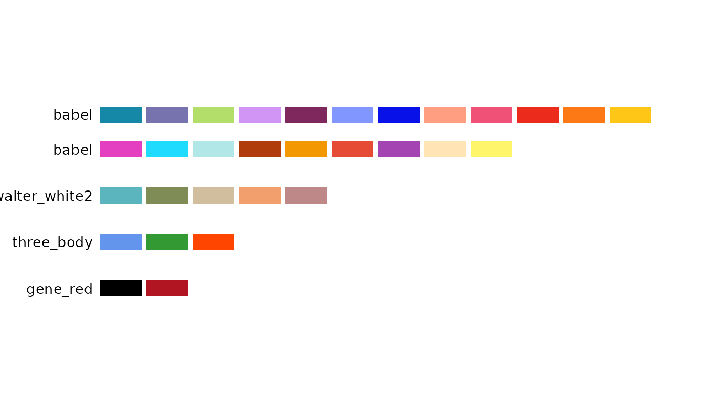
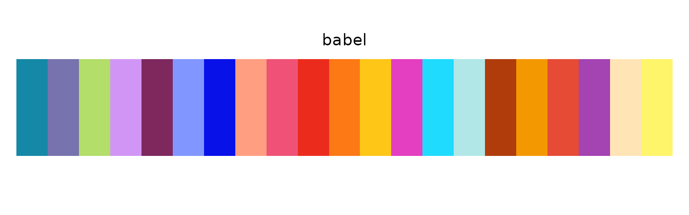
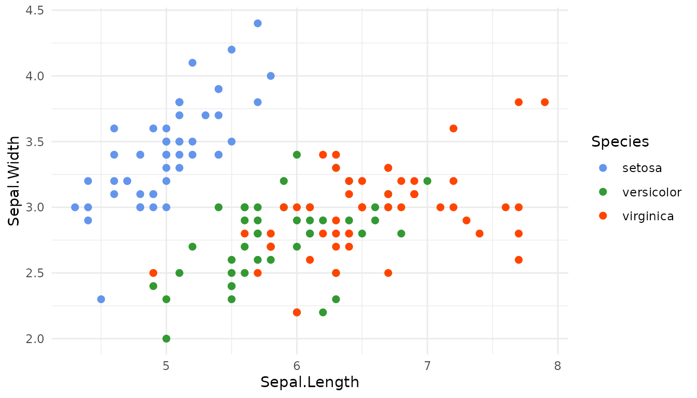
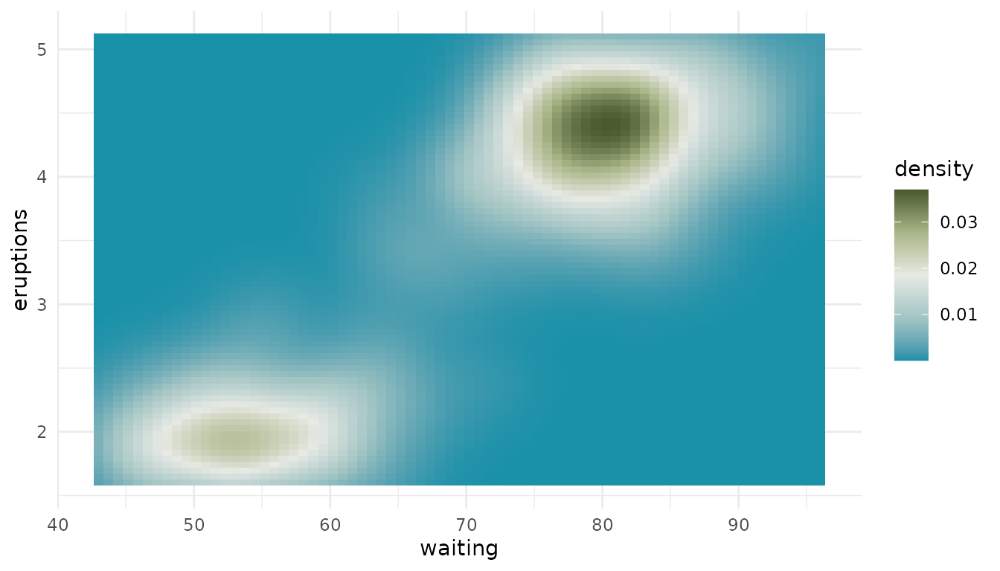

# Get Started with biopalette

## Overview

**biopalette** provides color palettes for biomedical visualization,
each sourced from a real image. This guide covers the core workflow:
browsing, retrieving, previewing, and using palettes in plots.

## Installation

``` r

pak::pkg_install("evanbio/biopalette")
```

## Browse Available Palettes

``` r

library(biopalette)

list_palettes()
#>                 name        type n_color       colors
#> 1       walter_white   diverging       5 #1991A9,....
#> 2      walter_white3   diverging       5 #B15F63,....
#> 3           gene_red qualitative       2 #000000,....
#> 4         three_body qualitative       3 #6495ED,....
#> 5      walter_white2 qualitative       5 #5AB5BF,....
#> 6              babel qualitative      21 #1688A7,....
#> 7   mitonuclear_blue  sequential       6 #EEF4FB,....
#> 8 mitonuclear_orange  sequential       6 #F8E7E3,....
```

[`list_palettes()`](https://evanbio.github.io/biopalette/reference/list_palettes.md)
returns a data frame of all available palettes with their name, type,
and number of colors.

[`palette_gallery()`](https://evanbio.github.io/biopalette/reference/palette_gallery.md)
renders a visual overview and returns one ggplot per page, so you can
display the page you want:

``` r

pages <- palette_gallery(verbose = FALSE)
names(pages)
#> [1] "sequential_page1"  "diverging_page1"   "qualitative_page1"

pages[["qualitative_page1"]]
```



## Retrieve Colors

``` r

# Full palette
get_palette("three_body")
#> [1] "#6495ED" "#339933" "#FF4500"

# First n colors
get_palette("babel", n = 5)
#> [1] "#1688A7" "#7673AE" "#B3DE69" "#D195F6" "#7E285E"

# Specify type for disambiguation
get_palette("walter_white", type = "diverging")
#> [1] "#1991A9" "#A3C5C4" "#E7E9E4" "#A9B688" "#495A2E"
```

The returned value is a character vector of HEX codes, ready to pass to
any plotting function.

## Preview a Palette

``` r

preview_palette("gene_red", plot_type = "rect")
```


``` r

preview_palette("babel", plot_type = "rect")
```



``` r

preview_palette("three_body", plot_type = "circle")
```


## Use in ggplot2

``` r

library(ggplot2)

ggplot(iris, aes(Sepal.Length, Sepal.Width, color = Species)) +
  geom_point(size = 2) +
  scale_color_manual(values = get_palette("three_body")) +
  theme_minimal()
```



For continuous scales, pass the colors to
[`scale_fill_gradientn()`](https://ggplot2.tidyverse.org/reference/scale_gradient.html)
or
[`scale_color_gradientn()`](https://ggplot2.tidyverse.org/reference/scale_gradient.html).
Diverging palettes are the natural fit here:

``` r

ggplot(faithfuld, aes(waiting, eruptions, fill = density)) +
  geom_tile() +
  scale_fill_gradientn(colors = get_palette("walter_white")) +
  theme_minimal()
```



## Color Utilities

``` r

hex2rgb("#1688A7")
#>       hex  r   g   b
#> 1 #1688A7 22 136 167
rgb2hex(c(22, 136, 167))
#> [1] "#1688A7"
```

## Function Reference

| Function | Purpose |
|----|----|
| [`list_palettes()`](https://evanbio.github.io/biopalette/reference/list_palettes.md) | Data frame of all available palettes |
| [`palette_gallery()`](https://evanbio.github.io/biopalette/reference/palette_gallery.md) | Visual gallery of all palettes |
| [`get_palette()`](https://evanbio.github.io/biopalette/reference/get_palette.md) | Retrieve colors by name, type, and size |
| [`preview_palette()`](https://evanbio.github.io/biopalette/reference/preview_palette.md) | Render color swatches |
| [`create_palette()`](https://evanbio.github.io/biopalette/reference/create_palette.md) | Add a new palette |
| [`compile_palettes()`](https://evanbio.github.io/biopalette/reference/compile_palettes.md) | Compile all JSONs into a named list |
| [`remove_palette()`](https://evanbio.github.io/biopalette/reference/remove_palette.md) | Remove a palette by name |
| [`hex2rgb()`](https://evanbio.github.io/biopalette/reference/hex2rgb.md) | HEX to RGB |
| [`rgb2hex()`](https://evanbio.github.io/biopalette/reference/rgb2hex.md) | RGB to HEX |

## Getting Help

- **Documentation**: <https://evanbio.github.io/biopalette/>
- **Issues**: [GitHub
  Issues](https://github.com/evanbio/biopalette/issues)
- **Function help**:
  [`?get_palette`](https://evanbio.github.io/biopalette/reference/get_palette.md),
  [`?preview_palette`](https://evanbio.github.io/biopalette/reference/preview_palette.md)
