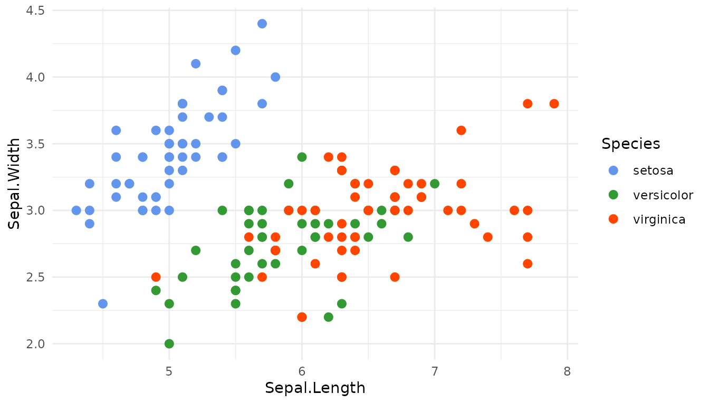
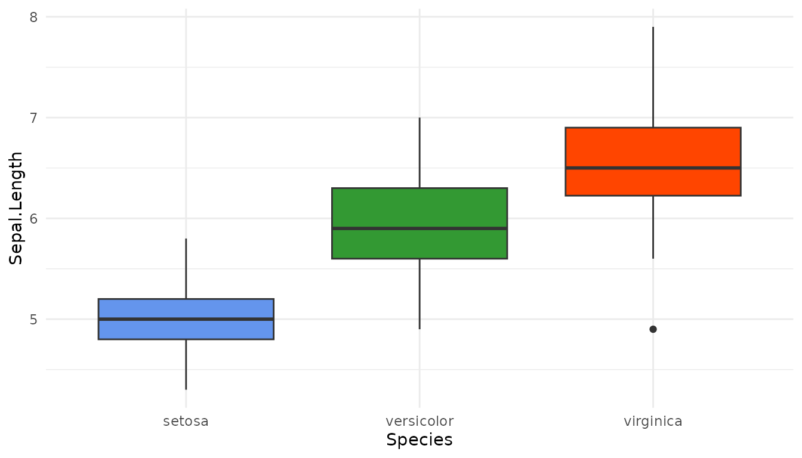
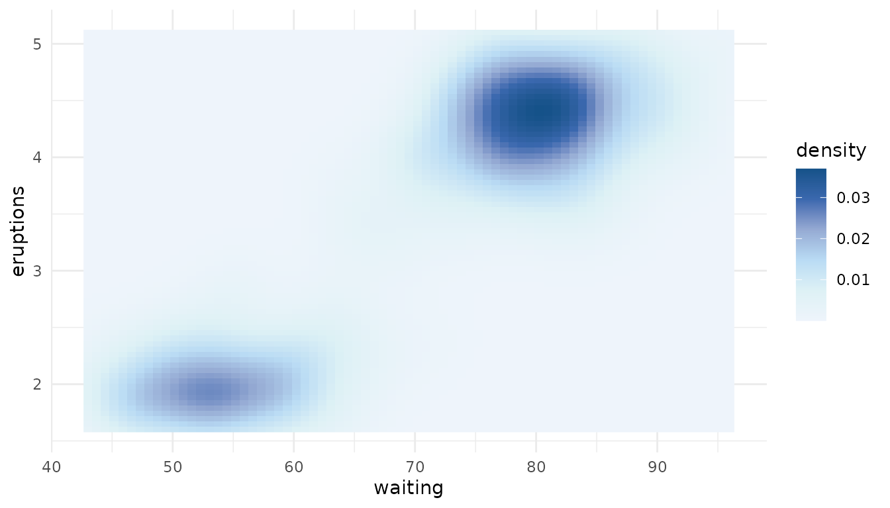
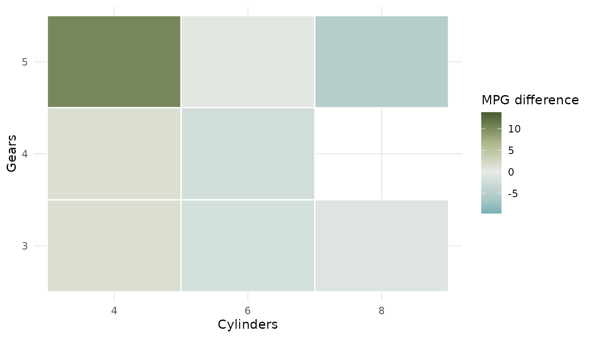
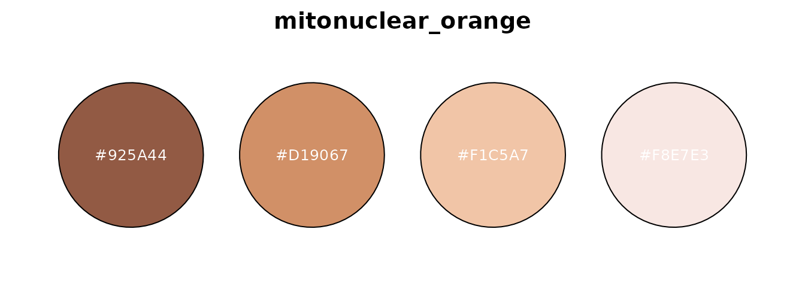

# Get started with biopalette

biopalette provides image-inspired color palettes for biomedical
visualization. Each palette has a documented source and one of three
types:

- **qualitative** palettes distinguish unordered groups;
- **sequential** palettes represent values progressing from low to high;
- **diverging** palettes show variation around a meaningful center.

This guide follows the usual workflow: find a palette, inspect it,
retrieve the colors, and apply it directly to a plot. See
[`vignette("install", package = "biopalette")`](https://evanbio.github.io/biopalette/articles/install.md)
if the package is not yet installed.

## Find a palette

Load biopalette and inspect the bundled collection:

``` r

library(biopalette)

list_palettes()[c("name", "type", "n_color")]
#>                    name        type n_color
#> 1          bcell_atlas2   diverging       5
#> 2          walter_white   diverging       5
#> 3         walter_white3   diverging       5
#> 4              gene_red qualitative       2
#> 5            heat_light qualitative       2
#> 6                 fargo qualitative       3
#> 7            three_body qualitative       3
#> 8         lipid_budding qualitative       4
#> 9         lactate_steps qualitative       5
#> 10        walter_white2 qualitative       5
#> 11           tam_pastel qualitative       6
#> 12          bcell_atlas qualitative       7
#> 13     cytokine_sensors qualitative       7
#> 14       immune_circuit qualitative       8
#> 15        cancer_mosaic qualitative      15
#> 16       bcell_clusters qualitative      20
#> 17                babel qualitative      21
#> 18   lipid_budding_blue  sequential       5
#> 19 lipid_budding_indigo  sequential       5
#> 20 lipid_budding_orange  sequential       5
#> 21   lipid_budding_rose  sequential       5
#> 22     mitonuclear_blue  sequential       6
#> 23   mitonuclear_orange  sequential       6
#> 24 immune_circuit_green  sequential       7
#> 25   immune_circuit_red  sequential       7
```

Filter by type when the visual role is already known:

``` r

list_palettes(type = "sequential")[c("name", "n_color")]
#>                   name n_color
#> 1   lipid_budding_blue       5
#> 2 lipid_budding_indigo       5
#> 3 lipid_budding_orange       5
#> 4   lipid_budding_rose       5
#> 5     mitonuclear_blue       6
#> 6   mitonuclear_orange       6
#> 7 immune_circuit_green       7
#> 8   immune_circuit_red       7
```

[`palette_info()`](https://evanbio.github.io/biopalette/reference/palette_info.md)
returns the complete metadata for one palette without drawing it:

``` r

palette_info("mitonuclear_blue")
#>               name       type n_color       colors
#> 1 mitonuclear_blue sequential       6 #EEF4FB,....
```

For visual browsing, call
[`palette_gallery()`](https://evanbio.github.io/biopalette/reference/palette_gallery.md)
in an interactive R session. It builds one gallery page per palette type
and reports each page as it is ready.

``` r

palette_gallery()
```

## Retrieve colors

[`get_palette()`](https://evanbio.github.io/biopalette/reference/get_palette.md)
returns a character vector of HEX colors. Palette names are unique
across the bundled collection, so `type` is normally unnecessary:

``` r

get_palette("three_body")
#> [1] "#6495ED" "#339933" "#FF4500"
get_palette("mitonuclear_blue")
#> [1] "#EEF4FB" "#DDF1F5" "#B9DBF4" "#95AAD3" "#3A68AE" "#155289"
```

The meaning of `n` follows the palette type. For a qualitative palette,
it selects the first `n` category colors and cannot exceed the palette
size:

``` r

get_palette("babel", n = 5)
#> [1] "#1688A7" "#7673AE" "#B3DE69" "#D195F6" "#7E285E"
```

For sequential and diverging palettes, the stored colors are stops along
a ramp. Asking for `n` colors samples the whole ramp in Lab color space
rather than taking colors from only one end:

``` r

get_palette("mitonuclear_blue", n = 3)
#> [1] "#EEF4FB" "#A7C2E3" "#155289"
get_palette("walter_white", n = 7)
#> [1] "#1991A9" "#80B3BB" "#BAD1CF" "#E7E9E4" "#BEC7A6" "#889669" "#495A2E"
```

Use `reverse = TRUE` when the direction of a palette should be flipped:

``` r

get_palette("mitonuclear_blue", n = 3, reverse = TRUE)
#> [1] "#155289" "#A7C2E3" "#EEF4FB"
```

The returned vector can be used anywhere that accepts R color values.
For ggplot2, the scale functions provide a shorter and safer route.

## Use a discrete scale

Map a qualitative palette to unordered groups with
[`scale_color_biopalette()`](https://evanbio.github.io/biopalette/reference/scale_color_biopalette.md):

``` r

library(ggplot2)

ggplot(iris, aes(Sepal.Length, Sepal.Width, color = Species)) +
  geom_point(size = 2.5) +
  scale_color_biopalette("three_body") +
  theme_minimal()
```



Use a `color` scale when the mapped aesthetic is `color` (or `colour`),
and a `fill` scale when the mapped aesthetic is `fill`. This distinction
belongs to the geometry, not to the palette itself:

``` r

ggplot(iris, aes(Species, Sepal.Length, fill = Species)) +
  geom_boxplot() +
  scale_fill_biopalette("three_body", guide = "none") +
  theme_minimal()
```



Discrete scales request exactly as many colors as the trained data has
levels. Qualitative palettes use their first `n` colors; sequential and
diverging palettes sample `n` colors across the complete ramp. A
qualitative palette raises an informative error when it does not contain
enough colors.

## Use a continuous gradient

Continuous data requires a sequential or diverging palette and one of
the gradient functions. A sequential fill gradient is appropriate for
density:

``` r

ggplot(faithfuld, aes(waiting, eruptions, fill = density)) +
  geom_raster() +
  scale_fill_biopalette_gradient("mitonuclear_blue") +
  theme_minimal()
```



For values interpreted relative to a reference point, use a diverging
palette and set `midpoint`. Here zero means no deviation from the mean:

``` r

plot_data <- transform(
  mtcars,
  cylinders = factor(cyl),
  gears = factor(gear),
  mpg_difference = mpg - mean(mpg)
)

ggplot(plot_data, aes(cylinders, gears, fill = mpg_difference)) +
  geom_tile(color = "white", linewidth = 0.5) +
  scale_fill_biopalette_gradient("walter_white", midpoint = 0) +
  labs(x = "Cylinders", y = "Gears", fill = "MPG difference") +
  theme_minimal()
```



Qualitative palettes cannot define continuous gradients because
interpolating unordered category colors has no stable meaning.

## Preview one palette

[`preview_palette()`](https://evanbio.github.io/biopalette/reference/preview_palette.md)
draws directly to the active graphics device. Its five styles are
`"bar"`, `"pie"`, `"point"`, `"rect"`, and `"circle"`:

``` r

preview_palette("walter_white", plot_type = "rect")
```


The same `n` and `reverse` rules used by
[`get_palette()`](https://evanbio.github.io/biopalette/reference/get_palette.md)
also apply to previews:

``` r

preview_palette(
  "mitonuclear_orange",
  n = 4,
  reverse = TRUE,
  plot_type = "circle"
)
```



## Convert color formats

[`hex2rgb()`](https://evanbio.github.io/biopalette/reference/hex2rgb.md)
and
[`rgb2hex()`](https://evanbio.github.io/biopalette/reference/rgb2hex.md)
convert between HEX and RGB or RGBA values. Alpha is preserved when
present:

``` r

rgba <- hex2rgb(c("#1688A7", "#FF450080"))
rgba
#>         hex   r   g   b alpha
#> 1   #1688A7  22 136 167    NA
#> 2 #FF450080 255  69   0   128
rgb2hex(rgba)
#> [1] "#1688A7"   "#FF450080"
```

## Next steps

- Read
  [`vignette("palette", package = "biopalette")`](https://evanbio.github.io/biopalette/articles/palette.md)
  for the sources, intended uses, and limitations of every bundled
  palette.
- Open
  [`?scale_color_biopalette`](https://evanbio.github.io/biopalette/reference/scale_color_biopalette.md)
  for discrete scale options.
- Open
  [`?scale_color_biopalette_gradient`](https://evanbio.github.io/biopalette/reference/scale_color_biopalette_gradient.md)
  for continuous gradients, transformations, custom stop positions, and
  diverging midpoints.
- Read
  [`vignette("tessera", package = "biopalette")`](https://evanbio.github.io/biopalette/articles/tessera.md)
  to explore palettes, example datasets, Palette Lab, and complete R
  figure recipes.
- Report reproducible problems in [GitHub
  Issues](https://github.com/evanbio/biopalette/issues).
