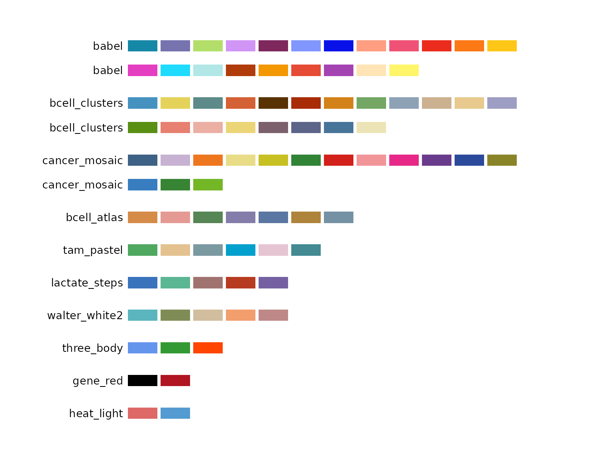
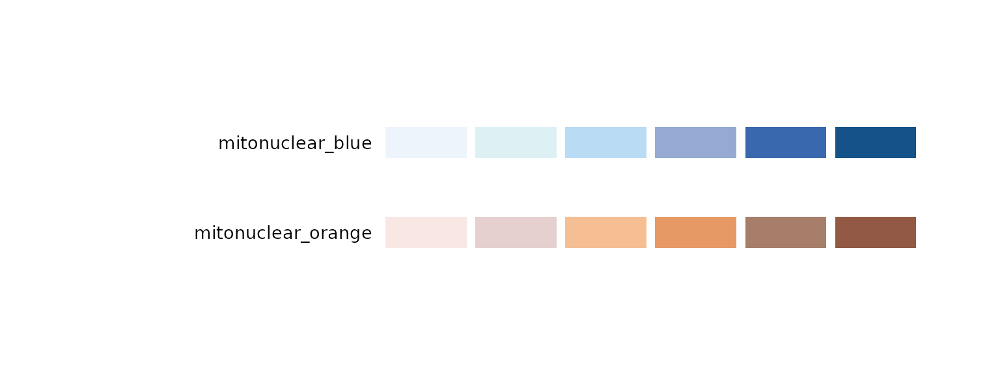
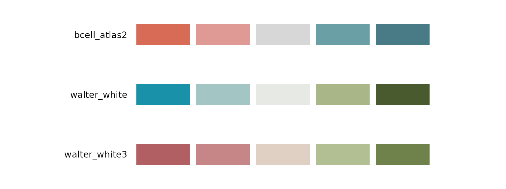

# Palettes included in biopalette

biopalette is a curated collection of image-inspired color palettes for
biomedical visualization. Every included palette has a documented
source, an intentional color order, a defined type, and notes about
where it works well.

This article is a guide to the collection. Complete source
records—including the original image, color table, reference labels, use
cases, and limitations— are available in the
[`palettes/`](https://github.com/evanbio/biopalette/tree/main/palettes)
directory on GitHub.

``` r

library(biopalette)
```

## Browse all palettes

Use
[`list_palettes()`](https://evanbio.github.io/biopalette/reference/list_palettes.md)
for a compact inventory:

``` r

list_palettes()[c("name", "type", "n_color")]
#>                  name        type n_color
#> 1        bcell_atlas2   diverging       5
#> 2        walter_white   diverging       5
#> 3       walter_white3   diverging       5
#> 4            gene_red qualitative       2
#> 5          heat_light qualitative       2
#> 6          three_body qualitative       3
#> 7       lactate_steps qualitative       5
#> 8       walter_white2 qualitative       5
#> 9          tam_pastel qualitative       6
#> 10        bcell_atlas qualitative       7
#> 11      cancer_mosaic qualitative      15
#> 12     bcell_clusters qualitative      20
#> 13              babel qualitative      21
#> 14   mitonuclear_blue  sequential       6
#> 15 mitonuclear_orange  sequential       6
```

Use
[`palette_gallery()`](https://evanbio.github.io/biopalette/reference/palette_gallery.md)
when choosing visually in an interactive R session:

``` r

palette_gallery()
```

The complete collection is summarized below. “Source record” opens the
full English curation record in this repository; “Tessera” opens the
corresponding visual page in the companion Tessera collection.

| Palette | Type | Colors | Source | Details |
|----|----|---:|----|----|
| `gene_red` | Qualitative | 2 | *Better Call Saul* poster | [Source record](https://github.com/evanbio/biopalette/tree/main/palettes/gene_red) · [Tessera](https://folio.evanzhou.org/tessera/palettes/gene_red) |
| `heat_light` | Qualitative | 2 | Bond ampholysis illustration, *Nature* (2024) | [Source record](https://github.com/evanbio/biopalette/tree/main/palettes/heat_light) · [Tessera](https://folio.evanzhou.org/tessera/palettes/heat_light) |
| `three_body` | Qualitative | 3 | Pan-cancer myeloid atlas, *Cell* (2021) | [Source record](https://github.com/evanbio/biopalette/tree/main/palettes/three_body) · [Tessera](https://folio.evanzhou.org/tessera/palettes/three_body) |
| `walter_white2` | Qualitative | 5 | *Breaking Bad* pilot poster | [Source record](https://github.com/evanbio/biopalette/tree/main/palettes/walter_white2) · [Tessera](https://folio.evanzhou.org/tessera/palettes/walter_white2) |
| `lactate_steps` | Qualitative | 5 | Lactate-metabolism workflow, JECCR (2024) | [Source record](https://github.com/evanbio/biopalette/tree/main/palettes/lactate_steps) · [Tessera](https://folio.evanzhou.org/tessera/palettes/lactate_steps) |
| `tam_pastel` | Qualitative | 6 | Pan-cancer myeloid atlas, *Cell* (2021) | [Source record](https://github.com/evanbio/biopalette/tree/main/palettes/tam_pastel) · [Tessera](https://folio.evanzhou.org/tessera/palettes/tam_pastel) |
| `cancer_mosaic` | Qualitative | 15 | Pan-cancer myeloid atlas, *Cell* (2021) | [Source record](https://github.com/evanbio/biopalette/tree/main/palettes/cancer_mosaic) · [Tessera](https://folio.evanzhou.org/tessera/palettes/cancer_mosaic) |
| `babel` | Qualitative | 21 | Pan-cancer myeloid atlas, *Cell* (2021) | [Source record](https://github.com/evanbio/biopalette/tree/main/palettes/babel) · [Tessera](https://folio.evanzhou.org/tessera/palettes/babel) |
| `mitonuclear_blue` | Sequential | 6 | Mito-nuclear communication in aging, TIBS (2022) | [Source record](https://github.com/evanbio/biopalette/tree/main/palettes/mitonuclear_blue) · [Tessera](https://folio.evanzhou.org/tessera/palettes/mitonuclear_blue) |
| `mitonuclear_orange` | Sequential | 6 | Mito-nuclear communication in aging, TIBS (2022) | [Source record](https://github.com/evanbio/biopalette/tree/main/palettes/mitonuclear_orange) · [Tessera](https://folio.evanzhou.org/tessera/palettes/mitonuclear_orange) |
| `walter_white` | Diverging | 5 | *Breaking Bad* pilot poster | [Source record](https://github.com/evanbio/biopalette/tree/main/palettes/walter_white) · [Tessera](https://folio.evanzhou.org/tessera/palettes/walter_white) |
| `walter_white3` | Diverging | 5 | *Breaking Bad* pilot poster | [Source record](https://github.com/evanbio/biopalette/tree/main/palettes/walter_white3) · [Tessera](https://folio.evanzhou.org/tessera/palettes/walter_white3) |

## Qualitative palettes

Qualitative palettes distinguish unordered categories. The first `n`
colors are returned when a smaller set is requested, because every
stored color is a curated category color rather than a stop on a
continuous ramp.

``` r

pages <- palette_gallery(type = "qualitative", verbose = FALSE)
pages[["qualitative_page1"]]
```



Choose the palette size to match the real number of groups:

- `gene_red` and `heat_light` provide restrained two-group contrasts;
- `three_body` provides three strongly separated colors;
- `walter_white2`, `lactate_steps`, and `tam_pastel` cover common
  medium-sized groupings;
- `cancer_mosaic` and `babel` support unusually large categorical
  displays.

Large qualitative palettes require help from position, direct labels,
shape, faceting, or annotation. Twenty-one categories cannot be made
effortless by color alone.

``` r

get_palette("babel", n = 5)
#> [1] "#1688A7" "#7673AE" "#B3DE69" "#D195F6" "#7E285E"
```

## Sequential palettes

`mitonuclear_blue` and `mitonuclear_orange` represent one-direction
change. Both run from a quiet light end to a darker visual anchor.

``` r

pages <- palette_gallery(type = "sequential", verbose = FALSE)
pages[["sequential_page1"]]
```



For sequential palettes, `n` samples the complete ramp in Lab color
space. It does not take only the first `n` pale stops:

``` r

get_palette("mitonuclear_blue", n = 3)
#> [1] "#EEF4FB" "#A7C2E3" "#155289"
get_palette("mitonuclear_orange", n = 8)
#> [1] "#F8E7E3" "#EAD7D5" "#EEC9B5" "#F4BA8C" "#E89E6B" "#C28968" "#A1745E"
#> [8] "#925A44"
```

Use the light-to-dark direction for increasing values unless the
scientific meaning requires the reverse. On white backgrounds,
boundaries or grid lines help the lightest colors remain visible.

## Diverging palettes

`walter_white` and `walter_white3` represent two directions around a
pale center.

``` r

pages <- palette_gallery(type = "diverging", verbose = FALSE)
pages[["diverging_page1"]]
```



Use a diverging palette only when the center has a meaningful
interpretation, such as zero fold change, a clinical threshold, or a
reference estimate. `walter_white` is the safer general-purpose option.
The rose-to-green ends of `walter_white3` can be difficult for common
red-green color-vision deficiencies.

``` r

get_palette("walter_white", n = 7)
#> [1] "#1991A9" "#80B3BB" "#BAD1CF" "#E7E9E4" "#BEC7A6" "#889669" "#495A2E"
```

## Source labels and new mappings

Some source records associate colors with cell types, cancer types,
workflow stages, or objects in a screen image. Those labels document
where the colors came from; they do not force the same labels in a new
dataset.

When remapping a palette:

1.  preserve a stable mapping throughout the project;
2.  explain the mapping in the figure legend;
3.  do not imply that biological meaning transfers with a HEX value;
4.  retain non-color cues when categories are numerous or close in
    appearance.

## Use the selected palette

Once selected, the palette name is the complete handoff to plotting
code:

``` r

# Unordered categories
scale_color_biopalette("three_body")
scale_fill_biopalette("tam_pastel")

# Ordered continuous values
scale_fill_biopalette_gradient("mitonuclear_blue")

# Signed values around zero
scale_color_biopalette_gradient("walter_white", midpoint = 0)
```

Use `reverse = TRUE` when the direction should be flipped. Palette names
in the bundled collection are unique, so `type` normally does not need
to be specified.

## Explore further

- Browse the complete [GitHub source
  records](https://github.com/evanbio/biopalette/tree/main/palettes) for
  original images, extraction notes, reference labels, and limitations.
- Open [Tessera palettes](https://folio.evanzhou.org/tessera) for a
  visual, reader-oriented view of the same named palettes.
- Use [Palette Lab](https://folio.evanzhou.org/apps/palette-lab) to
  switch the palettes across a consistent set of graphical displays.
- Read
  [`vignette("tessera", package = "biopalette")`](https://evanbio.github.io/biopalette/articles/tessera.md)
  to continue from palette discovery to data, R recipes, and complete
  figures.

## Propose a palette

New palettes enter the public collection through review. A proposal
should include the source image, source attribution, palette JSON,
preview, intended type, use cases, and known limitations—not only an
attractive vector of HEX values.

See the [contribution
guide](https://github.com/evanbio/biopalette/blob/main/CONTRIBUTING.md)
before opening a pull request.
