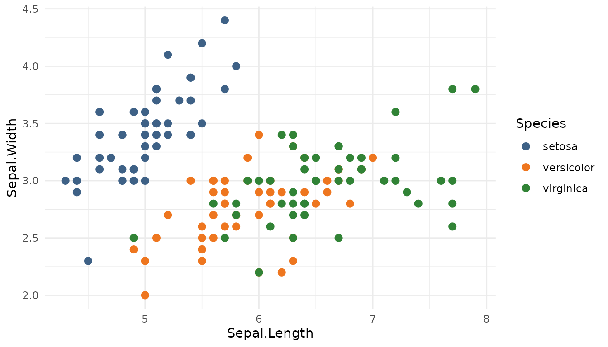
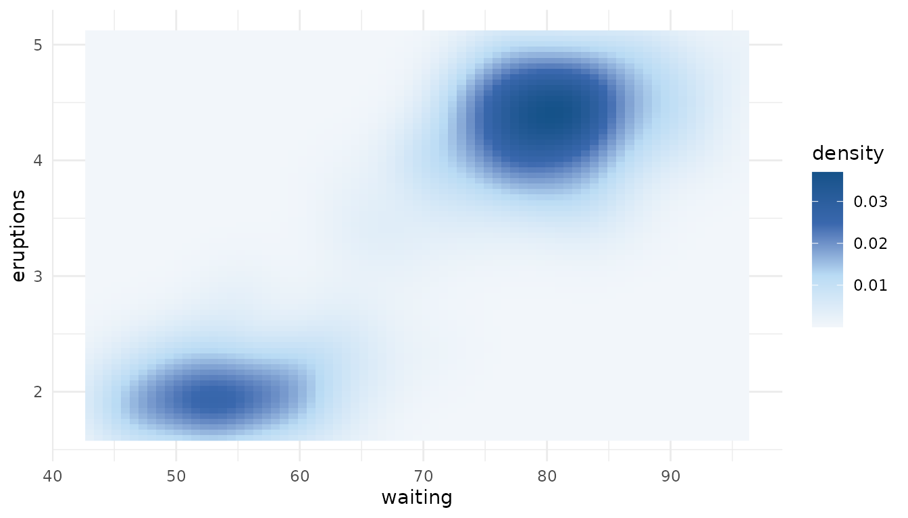

# Managing custom palette collections

biopalette includes a curated palette collection, but the same tools can
read and manage a collection owned by a project, laboratory, or
organization. A custom collection is useful when colors carry stable
meaning across several figures or analyses and should be stored,
reviewed, and reused like other project data.

This vignette covers the complete lifecycle of such a collection. For
the bundled palettes and plotting scales, begin with
[`vignette("get-started", package = "biopalette")`](https://evanbio.github.io/biopalette/articles/get-started.md).

``` r

library(biopalette)
```

## Collection structure

A collection is a directory with up to three type subdirectories:

``` text
palettes/
├── qualitative/
├── sequential/
└── diverging/
```

Each palette is one JSON file. There is no compiled copy or secondary
data format. A minimal file contains a name, a type, and a vector of HEX
colors:

``` json
{
  "name": "treatment_groups",
  "type": "qualitative",
  "colors": ["#3E6186", "#EE761F", "#318336"]
}
```

The file name must match `name`, and its parent directory must match
`type`. Palette names are unique across the entire collection, so a name
cannot refer to different palettes under different types.

Choose the type from the meaning of the colors:

- `qualitative` for unordered categories;
- `sequential` for an ordered low-to-high ramp;
- `diverging` for two directions around a meaningful center.

## Create a collection

For this example, create an isolated temporary directory. In a real
project, use a stable path such as `config/palettes` or
`assets/palettes` and commit the JSON files to version control.

``` r

palettes_dir <- tempfile("biopalette-palettes-")
```

[`create_palette()`](https://evanbio.github.io/biopalette/reference/create_palette.md)
creates the required type directory and writes a validated JSON file:

``` r

create_palette(
  name = "treatment_groups",
  type = "qualitative",
  colors = c("#3E6186", "#EE761F", "#318336"),
  palettes_dir = palettes_dir
)
#> ✔ Palette saved: /tmp/RtmppsPEjo/biopalette-palettes-1cdf7d443ce4/qualitative/treatment_groups.json

create_palette(
  name = "response_blue",
  type = "sequential",
  colors = c("#F2F6FA", "#B9DBF4", "#3A68AE", "#155289"),
  palettes_dir = palettes_dir
)
#> ✔ Palette saved: /tmp/RtmppsPEjo/biopalette-palettes-1cdf7d443ce4/sequential/response_blue.json

create_palette(
  name = "effect_balance",
  type = "diverging",
  colors = c("#1991A9", "#A3C5C4", "#E7E9E4", "#D7AD85", "#A65C31"),
  palettes_dir = palettes_dir
)
#> ✔ Palette saved: /tmp/RtmppsPEjo/biopalette-palettes-1cdf7d443ce4/diverging/effect_balance.json
```

`palettes_dir` is required for every write. This is deliberate: package
data cannot be modified accidentally, and a write always has an explicit
owner and destination.

## Inspect and use the collection

Pass the same directory to any palette-reading function:

``` r

list_palettes(palettes_dir = palettes_dir)[c("name", "type", "n_color")]
#>               name        type n_color
#> 1   effect_balance   diverging       5
#> 2 treatment_groups qualitative       3
#> 3    response_blue  sequential       4
palette_info("response_blue", palettes_dir = palettes_dir)
#>            name       type n_color       colors
#> 1 response_blue sequential       4 #F2F6FA,....
get_palette("treatment_groups", palettes_dir = palettes_dir)
#> [1] "#3E6186" "#EE761F" "#318336"
```

Custom palettes follow exactly the same type-aware `n` rules as bundled
ones. A qualitative palette returns its first `n` category colors, while
sequential and diverging palettes sample the complete ramp:

``` r

get_palette("treatment_groups", n = 2, palettes_dir = palettes_dir)
#> [1] "#3E6186" "#EE761F"
get_palette("response_blue", n = 7, palettes_dir = palettes_dir)
#> [1] "#F2F6FA" "#D6E8F7" "#B9DBF4" "#7D9FD1" "#3A68AE" "#295D9B" "#155289"
```

They also work directly in ggplot2 scales:

``` r

library(ggplot2)

ggplot(iris, aes(Sepal.Length, Sepal.Width, color = Species)) +
  geom_point(size = 2.5) +
  scale_color_biopalette(
    "treatment_groups",
    palettes_dir = palettes_dir
  ) +
  theme_minimal()
```



``` r

ggplot(faithfuld, aes(waiting, eruptions, fill = density)) +
  geom_raster() +
  scale_fill_biopalette_gradient(
    "response_blue",
    palettes_dir = palettes_dir
  ) +
  theme_minimal()
```



The bundled and custom collections remain separate. Omitting
`palettes_dir` always selects the palettes installed with biopalette;
supplying it selects only that custom collection. The two collections
are not merged implicitly.

## Update a palette safely

Existing files are protected from accidental replacement:

``` r

create_palette(
  "response_blue",
  "sequential",
  c("#EFF5FB", "#9ECAE1", "#3182BD"),
  palettes_dir = palettes_dir
)
#> Error:
#> ! Palette "response_blue" already exists. Use `overwrite = TRUE` to
#>   replace.
```

Use `overwrite = TRUE` only when replacement is intentional:

``` r

create_palette(
  "response_blue",
  "sequential",
  c("#EFF5FB", "#9ECAE1", "#3182BD"),
  palettes_dir = palettes_dir,
  overwrite = TRUE
)
#> ℹ Overwriting existing palette: "response_blue"
#> ✔ Palette saved: /tmp/RtmppsPEjo/biopalette-palettes-1cdf7d443ce4/sequential/response_blue.json

get_palette("response_blue", palettes_dir = palettes_dir)
#> [1] "#EFF5FB" "#9ECAE1" "#3182BD"
```

Writes are transactional from the caller’s perspective. biopalette
writes a temporary JSON file beside the destination, reads it back
through the normal validator, and commits it only after validation
succeeds. If an overwrite cannot be completed, the previous palette is
retained whenever the file system allows it. The collection cache is
invalidated only after a successful write.

## Validation and collaboration

All reading functions use the same collection loader. It checks every
JSON file before returning data and reports the discovered problems
together. A malformed file is not silently skipped, because silently
dropping a palette would turn a data-quality problem into a misleading
“not found” error later.

Useful project practices are therefore straightforward:

1.  Keep the collection under version control.
2.  Review palette type, order, and source meaning along with the HEX
    values.
3.  Use one stable palette name in analysis code instead of copying
    vectors between scripts.
4.  Exercise the collection in continuous integration with a read such
    as:

``` r

stopifnot(nrow(list_palettes(palettes_dir = "config/palettes")) > 0)
```

This check invokes the same validation path used by plots and palette
queries; it does not create a second validation contract.

## Remove a palette

Deletion also requires an explicit custom collection directory. If
`type` is omitted, biopalette searches all three type directories:

``` r

remove_palette("response_blue", palettes_dir = palettes_dir)
#> ✔ Removed "response_blue" from sequential
remove_palette(
  "treatment_groups",
  type = "qualitative",
  palettes_dir = palettes_dir
)
#> ✔ Removed "treatment_groups" from qualitative
```

The function returns `TRUE` invisibly after a successful deletion and
`FALSE` invisibly when the palette is absent. The bundled collection
cannot be removed through this interface because `palettes_dir` has no
write default.

``` r

remove_palette("effect_balance", palettes_dir = palettes_dir)
#> ✔ Removed "effect_balance" from diverging
unlink(palettes_dir, recursive = TRUE)
```

## Color representation

Palette JSON accepts uppercase or lowercase 6-digit HEX colors and
8-digit HEX colors with alpha.
[`hex2rgb()`](https://evanbio.github.io/biopalette/reference/hex2rgb.md)
and
[`rgb2hex()`](https://evanbio.github.io/biopalette/reference/rgb2hex.md)
provide a lossless conversion path when colors need to be inspected or
exchanged with numeric RGB(A) data:

``` r

channels <- hex2rgb(c("#3E6186", "#EE761F80"))
channels
#>         hex   r   g   b alpha
#> 1   #3E6186  62  97 134    NA
#> 2 #EE761F80 238 118  31   128
rgb2hex(channels)
#> [1] "#3E6186"   "#EE761F80"
```

For color derivation and interpolation, use a color-aware workflow
rather than averaging RGB channels casually. biopalette itself
interpolates sequential and diverging ramps in Lab color space so
palette retrieval and ggplot2 gradients remain consistent.

## Related documentation

- [`?create_palette`](https://evanbio.github.io/biopalette/reference/create_palette.md)
  and
  [`?remove_palette`](https://evanbio.github.io/biopalette/reference/remove_palette.md)
  document the write operations.
- [`?get_palette`](https://evanbio.github.io/biopalette/reference/get_palette.md)
  explains type-aware sampling.
- [`?scale_color_biopalette`](https://evanbio.github.io/biopalette/reference/scale_color_biopalette.md)
  and
  [`?scale_color_biopalette_gradient`](https://evanbio.github.io/biopalette/reference/scale_color_biopalette_gradient.md)
  document custom scale options.
- [GitHub Issues](https://github.com/evanbio/biopalette/issues) is the
  place to report reproducible collection or validation problems.
