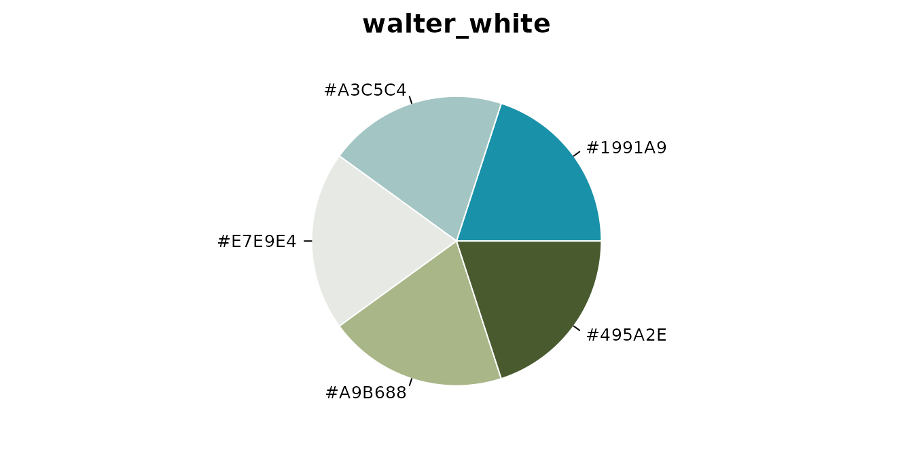
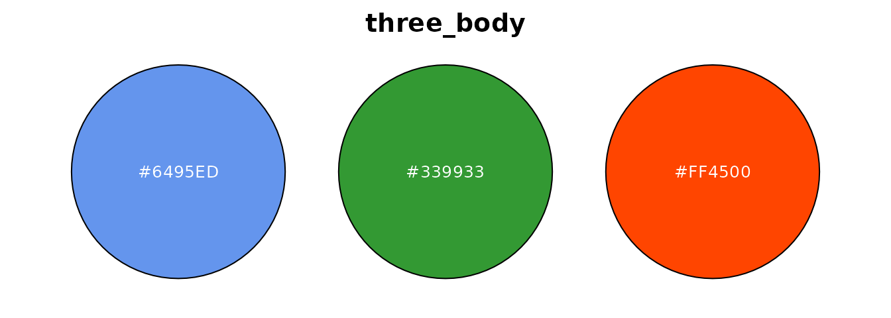
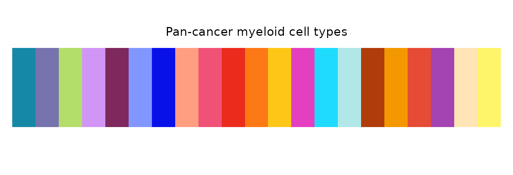
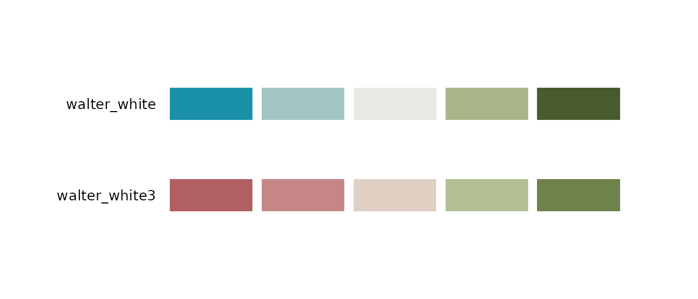

# Color Palette Management

## Overview

The palette module provides nine functions covering four areas:

| Area | Functions |
|----|----|
| Querying palettes | [`get_palette()`](https://evanbio.github.io/biopalette/reference/get_palette.md), [`list_palettes()`](https://evanbio.github.io/biopalette/reference/list_palettes.md) |
| Visualization | [`preview_palette()`](https://evanbio.github.io/biopalette/reference/preview_palette.md), [`palette_gallery()`](https://evanbio.github.io/biopalette/reference/palette_gallery.md) |
| Managing palettes | [`create_palette()`](https://evanbio.github.io/biopalette/reference/create_palette.md), [`remove_palette()`](https://evanbio.github.io/biopalette/reference/remove_palette.md), [`compile_palettes()`](https://evanbio.github.io/biopalette/reference/compile_palettes.md) |
| Color conversion | [`hex2rgb()`](https://evanbio.github.io/biopalette/reference/hex2rgb.md), [`rgb2hex()`](https://evanbio.github.io/biopalette/reference/rgb2hex.md) |

``` r

library(biopalette)
```

Palettes are stored as JSON files organized under three subdirectories —
`sequential/`, `diverging/`, and `qualitative/` — and compiled into the
`palettes` package dataset via
[`compile_palettes()`](https://evanbio.github.io/biopalette/reference/compile_palettes.md).

Every chunk below is evaluated when the vignette is built, so the output
you see is what the current version actually produces.

------------------------------------------------------------------------

## 1 Querying Palettes

### `get_palette()` — Retrieve a palette by name

Returns a character vector of HEX color codes. If `type` is omitted, the
palette type is auto-detected. Use `n` to take the first N colors from a
larger palette.

``` r

# Auto-detect type
get_palette("babel")
#>  [1] "#1688A7" "#7673AE" "#B3DE69" "#D195F6" "#7E285E" "#8197FF" "#0911E9"
#>  [8] "#FF9E81" "#EF5276" "#EB2C1D" "#FD7915" "#FEC718" "#E43EC1" "#1FDBFE"
#> [15] "#B1E7E7" "#B03C0B" "#F39800" "#E64B35" "#A443B2" "#FFE4B5" "#FFF56A"

# Specify type explicitly, take only the first 5 colors
get_palette("babel", type = "qualitative", n = 5)
#> [1] "#1688A7" "#7673AE" "#B3DE69" "#D195F6" "#7E285E"
```

When `type` is wrong, the error message tells you where the palette
actually lives:

``` r

get_palette("walter_white", type = "qualitative")
#> Error:
#> ! Palette "walter_white" not found under "qualitative", but exists under
#>   "diverging". Try: `get_palette("walter_white", type = "diverging")`
```

Requesting more colors than the palette contains raises an informative
error rather than silently recycling:

``` r

get_palette("gene_red", type = "qualitative", n = 5)
#> Error:
#> ! Palette "gene_red" only has 2 colors, but requested 5.
```

------------------------------------------------------------------------

### `list_palettes()` — Browse available palettes

Returns a data frame with columns `name`, `type`, `n_color`, and
`colors`. It reads the **compiled package dataset**, not a directory on
disk.

``` r

list_palettes()
#>                 name        type n_color       colors
#> 1       walter_white   diverging       5 #1991A9,....
#> 2      walter_white3   diverging       5 #B15F63,....
#> 3           gene_red qualitative       2 #000000,....
#> 4         three_body qualitative       3 #6495ED,....
#> 5      walter_white2 qualitative       5 #5AB5BF,....
#> 6              babel qualitative      21 #1688A7,....
#> 7   mitonuclear_blue  sequential       6 #EEF4FB,....
#> 8 mitonuclear_orange  sequential       6 #F8E7E3,....
```

Filter by one or more types with the `type` argument:

``` r

list_palettes(type = "qualitative")
#>            name        type n_color       colors
#> 1      gene_red qualitative       2 #000000,....
#> 2    three_body qualitative       3 #6495ED,....
#> 3 walter_white2 qualitative       5 #5AB5BF,....
#> 4         babel qualitative      21 #1688A7,....

list_palettes(type = c("sequential", "diverging"))
#>                 name       type n_color       colors
#> 1       walter_white  diverging       5 #1991A9,....
#> 2      walter_white3  diverging       5 #B15F63,....
#> 3   mitonuclear_blue sequential       6 #EEF4FB,....
#> 4 mitonuclear_orange sequential       6 #F8E7E3,....
```

Results are sorted by `type`, `n_color`, and `name` by default. Set
`sort = FALSE` to keep the original file order.

------------------------------------------------------------------------

## 2 Visualization

### `preview_palette()` — Visualize a single palette

Plots a single palette using one of five styles: `"bar"` (default),
`"pie"`, `"point"`, `"rect"`, or `"circle"`. Returns `NULL` invisibly —
called for the plotting side effect.

``` r

preview_palette("gene_red", plot_type = "rect")
```


``` r

preview_palette("walter_white", type = "diverging", plot_type = "pie")
```



``` r

preview_palette("three_body", n = 3, plot_type = "circle")
```



Supply `title` to override the default title (which is the palette
name):

``` r

preview_palette("babel", plot_type = "rect",
                title = "Pan-cancer myeloid cell types")
```



------------------------------------------------------------------------

### `palette_gallery()` — Browse all palettes at once

Renders a paged gallery of all palettes and returns a named list of
ggplot objects (one per page). Useful for picking colors interactively.

``` r

plots <- palette_gallery()
#> ℹ Type sequential: 2 palettes -> 1 page(s)
#> ✔ Built "sequential_page1"
#> ℹ Type diverging: 2 palettes -> 1 page(s)
#> ✔ Built "diverging_page1"
#> ℹ Type qualitative: 4 palettes -> 1 page(s)
#> ✔ Built "qualitative_page1"
names(plots)
#> [1] "sequential_page1"  "diverging_page1"   "qualitative_page1"
```

Access individual pages from the returned list:

``` r

plots[["qualitative_page1"]]
```


Filter by type and control how many palettes appear per page. Set
`verbose = FALSE` to suppress progress messages when calling
[`palette_gallery()`](https://evanbio.github.io/biopalette/reference/palette_gallery.md)
programmatically:

``` r

pages <- palette_gallery(type = "diverging", verbose = FALSE)
pages[["diverging_page1"]]
```



------------------------------------------------------------------------

## 3 Managing Palettes

### `create_palette()` — Save a custom palette

Writes a named palette as a JSON file under
`color_dir/<type>/<name>.json`. The directory is created automatically
if it does not exist.

``` r

temp_dir <- file.path(tempdir(), "palettes")

create_palette("my_blues", "sequential", c("#deebf7", "#9ecae1", "#3182bd"),
               color_dir = temp_dir)
#> ✔ Palette saved: /tmp/RtmpxgTzyJ/palettes/sequential/my_blues.json

create_palette("my_trio", "qualitative",
               c("#E64B35", "#4DBBD5", "#00A087"),
               color_dir = temp_dir)
#> ✔ Palette saved: /tmp/RtmpxgTzyJ/palettes/qualitative/my_trio.json
```

Note that this writes a **file**; it does not register the palette with
the package.
[`get_palette()`](https://evanbio.github.io/biopalette/reference/get_palette.md)
and
[`list_palettes()`](https://evanbio.github.io/biopalette/reference/list_palettes.md)
read the compiled dataset, so a palette in your own directory only
becomes visible once that directory is compiled — see
[`compile_palettes()`](https://evanbio.github.io/biopalette/reference/compile_palettes.md)
below.

By default, saving over an existing name raises an error. Pass
`overwrite = TRUE` to replace it:

``` r

create_palette("my_blues", "sequential", c("#c6dbef", "#6baed6", "#2171b5"),
               color_dir = temp_dir, overwrite = TRUE)
#> ℹ Overwriting existing palette: "my_blues"
#> ✔ Palette saved: /tmp/RtmpxgTzyJ/palettes/sequential/my_blues.json
```

``` r

# Without overwrite = TRUE
create_palette("my_blues", "sequential", c("#deebf7", "#9ecae1", "#3182bd"),
               color_dir = temp_dir)
#> Error:
#> ! Palette "my_blues" already exists. Use `overwrite = TRUE` to replace.
```

The function invisibly returns a list with `path` and `info` so the
result can be captured when needed.

------------------------------------------------------------------------

### `remove_palette()` — Delete a palette JSON

Removes a palette JSON file by name. If `type` is omitted, all three
type directories are searched in order.

``` r

remove_palette("my_blues", color_dir = temp_dir)
#> ✔ Removed "my_blues" from sequential

# Specify type to skip the search
remove_palette("my_trio", type = "qualitative", color_dir = temp_dir)
#> ✔ Removed "my_trio" from qualitative
```

If the palette is not found in any directory, a message is issued and
the function returns `FALSE` invisibly:

``` r

remove_palette("nonexistent", color_dir = temp_dir)
#> ! Palette "nonexistent" not found in any type.
```

------------------------------------------------------------------------

### `compile_palettes()` — Build the palette dataset

Reads all JSON files under `palettes_dir/sequential/`,
`palettes_dir/diverging/`, and `palettes_dir/qualitative/`, validates
them, and returns a structured list. This is the function used in
`data-raw/palettes.R` to rebuild the `palettes` package dataset via
`usethis::use_data()`.

``` r

compiled <- compile_palettes(
  palettes_dir = system.file("extdata", "palettes", package = "biopalette")
)
#> ✔ Compiled 8 palettes: Sequential=2, Diverging=2, Qualitative=4
```

The return value is a named list with three elements — `sequential`,
`diverging`, and `qualitative` — each of which is a named list of HEX
vectors:

``` r

names(compiled)
#> [1] "sequential"  "diverging"   "qualitative"

compiled$qualitative[["three_body"]]
#> [1] "#6495ED" "#339933" "#FF4500"
```

> Validation is strict: a JSON file with a missing field, an unknown
> type, or an invalid HEX code **aborts the whole compile** rather than
> being skipped, so a broken file can never quietly drop a palette out
> of the dataset. Duplicate palette names within the same type are a
> softer case — they emit a message and the last file read wins.

------------------------------------------------------------------------

## 4 Color Conversion

### `hex2rgb()` — HEX to RGB data frame

Converts a character vector of HEX codes to a data frame with columns
`hex`, `r`, `g`, `b`. Both 6-digit (`#RRGGBB`) and 8-digit (`#RRGGBBAA`)
codes are accepted; the alpha channel is silently ignored.

``` r

hex2rgb("#1688A7")
#>       hex  r   g   b
#> 1 #1688A7 22 136 167

hex2rgb(c("#1688A7", "#FF4500", "#339933"))
#>       hex   r   g   b
#> 1 #1688A7  22 136 167
#> 2 #FF4500 255  69   0
#> 3 #339933  51 153  51
```

The `#` prefix is required; codes that fail the pattern and `NA` values
are both reported as invalid:

``` r

hex2rgb("1688A7")
#> Error:
#> ! `hex` contains invalid HEX codes: "1688A7".
```

``` r

hex2rgb(c("#1688A7", NA))
#> Error:
#> ! `hex` contains invalid HEX codes: NA.
```

------------------------------------------------------------------------

### `rgb2hex()` — RGB to HEX color codes

The symmetric counterpart to
[`hex2rgb()`](https://evanbio.github.io/biopalette/reference/hex2rgb.md).
Accepts either a numeric vector of length 3 or the data frame returned
by
[`hex2rgb()`](https://evanbio.github.io/biopalette/reference/hex2rgb.md).
Non-integer values are rounded before conversion.

``` r

# Single color as a length-3 vector
rgb2hex(c(22, 136, 167))
#> [1] "#1688A7"

# Round-trip: HEX -> RGB -> HEX
rgb2hex(hex2rgb(c("#1688A7", "#FF4500")))
#> [1] "#1688A7" "#FF4500"

# Non-integer values are rounded
rgb2hex(c(21.7, 136.2, 167.4))
#> [1] "#1688A7"
```

Typical failure cases for the vector form:

``` r

rgb2hex(c(22, 136))
#> Error:
#> ! `rgb` must be a numeric vector of length 3.
```

``` r

rgb2hex(c(22, 136, 300))
#> Error:
#> ! `rgb` values must be in [0, 255].
```

And for the data frame form:

``` r

rgb2hex(data.frame(r = 22, g = 136))
#> Error:
#> ! `rgb` must have columns "r", "g", and "b". Missing: "b".
```

``` r

rgb2hex(data.frame(r = 22, g = 136, b = 300))
#> Error:
#> ! Column "b" in `rgb` must be numeric with values in [0, 255].
```

------------------------------------------------------------------------

## 5 A Combined Workflow

The palette and conversion functions compose naturally. The example
below picks a qualitative palette, converts its colors to RGB, lightens
them, and saves the result as a new palette.

``` r

# 1. Retrieve a qualitative palette
colors <- get_palette("three_body", type = "qualitative")
colors
#> [1] "#6495ED" "#339933" "#FF4500"

# 2. Convert to RGB for numeric manipulation
rgb_df <- hex2rgb(colors)
rgb_df
#>       hex   r   g   b
#> 1 #6495ED 100 149 237
#> 2 #339933  51 153  51
#> 3 #FF4500 255  69   0

# 3. Lighten each color by blending 50% toward white
rgb_light <- rgb_df
rgb_light[c("r", "g", "b")] <- (rgb_df[c("r", "g", "b")] + 255) / 2

# 4. Convert back to HEX
light_hex <- rgb2hex(rgb_light)
light_hex
#> [1] "#B2CAF6" "#99CC99" "#FFA280"
```

``` r

# 5. Save the derived palette to your own directory
create_palette("three_body_light", "qualitative", light_hex,
               color_dir = temp_dir)
#> ✔ Palette saved: /tmp/RtmpxgTzyJ/palettes/qualitative/three_body_light.json

# 6. Compile that directory to make the palette usable.
#    create_palette() wrote a file; compile_palettes() is what turns a
#    directory of files into the list the query functions work with.
mine <- compile_palettes(temp_dir)
#> ✔ Compiled 1 palette: Sequential=0, Diverging=0, Qualitative=1
mine$qualitative[["three_body_light"]]
#> [1] "#B2CAF6" "#99CC99" "#FFA280"
```

``` r

# 7. Clean up
unlink(temp_dir, recursive = TRUE)
```

To make a palette part of the package itself rather than a local
directory, write its JSON under `inst/extdata/palettes/` and rebuild the
dataset with `data-raw/palettes.R`.

------------------------------------------------------------------------

## Getting Help

- [`?get_palette`](https://evanbio.github.io/biopalette/reference/get_palette.md),
  [`?list_palettes`](https://evanbio.github.io/biopalette/reference/list_palettes.md)
- [`?preview_palette`](https://evanbio.github.io/biopalette/reference/preview_palette.md),
  [`?palette_gallery`](https://evanbio.github.io/biopalette/reference/palette_gallery.md)
- [`?create_palette`](https://evanbio.github.io/biopalette/reference/create_palette.md),
  [`?remove_palette`](https://evanbio.github.io/biopalette/reference/remove_palette.md),
  [`?compile_palettes`](https://evanbio.github.io/biopalette/reference/compile_palettes.md)
- [`?hex2rgb`](https://evanbio.github.io/biopalette/reference/hex2rgb.md),
  [`?rgb2hex`](https://evanbio.github.io/biopalette/reference/rgb2hex.md)
- [GitHub Issues](https://github.com/evanbio/biopalette/issues)
