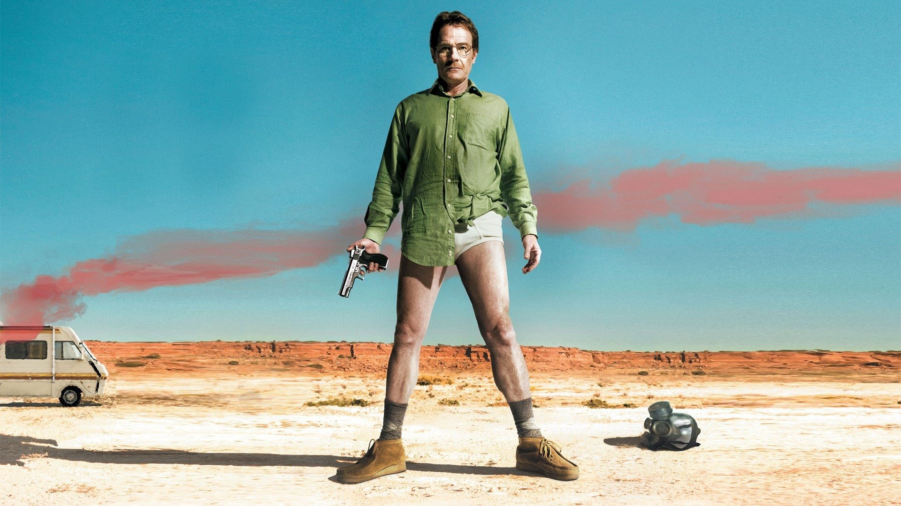
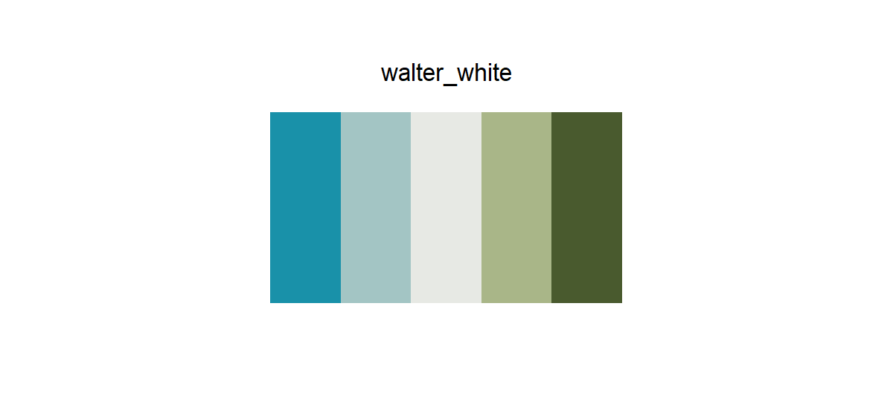
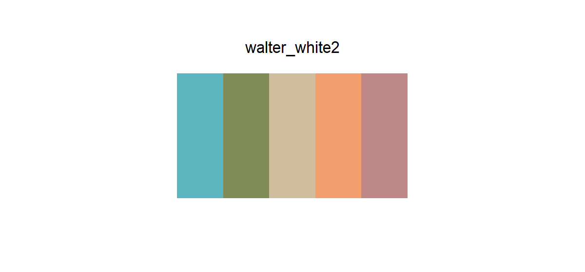
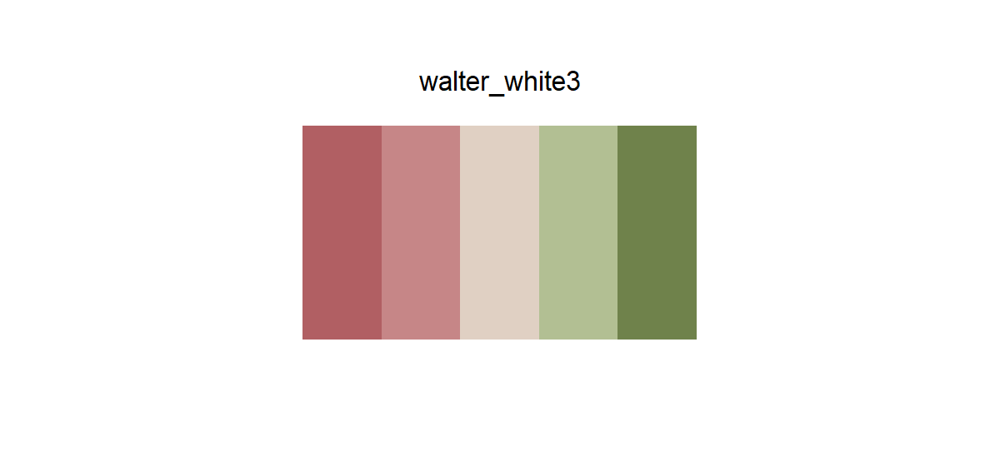

# 002 — walter_white

## Source

Poster from *Breaking Bad* — the pilot. Walter White, still with hair, standing in the New Mexico desert in his underwear.

Back when he was still a hamburger, not yet Heisenberg.

## Palettes

### walter_white

| # | HEX | Color |
|---|---|---|
| 1 | `#1991A9` | Sky blue |
| 2 | `#A3C5C4` | Pale blue-grey |
| 3 | `#E7E9E4` | Cold off-white |
| 4 | `#A9B688` | Sage green |
| 5 | `#495A2E` | Deep olive |

**Type:** Diverging

**Use cases:**
- Differential expression heatmaps
- Fold-change visualization
- Any two-sided continuous data needing a neutral anchor

---

### walter_white2

| # | HEX | Color |
|---|---|---|
| 1 | `#5AB5BF` | Sky teal |
| 2 | `#808C56` | Olive green |
| 3 | `#D1BE9E` | RV beige |
| 4 | `#F29E6D` | Desert orange |
| 5 | `#BF8888` | Pink smoke |

**Type:** Qualitative

**Use cases:**
- Group coloring (cell types, conditions, clusters)
- Any categorical data with up to 5 levels

---

### walter_white3

| # | HEX | Color |
|---|---|---|
| 1 | `#B15F63` | Deep rose |
| 2 | `#C68687` | Dusty pink |
| 3 | `#E0D0C3` | Warm beige |
| 4 | `#B2BF93` | Pale sage |
| 5 | `#6F824B` | Forest green |

**Type:** Diverging

**Use cases:**
- Same as `walter_white`, but warmer in tone
- A Backup option when a cooler palette conflicts with other figure elements
