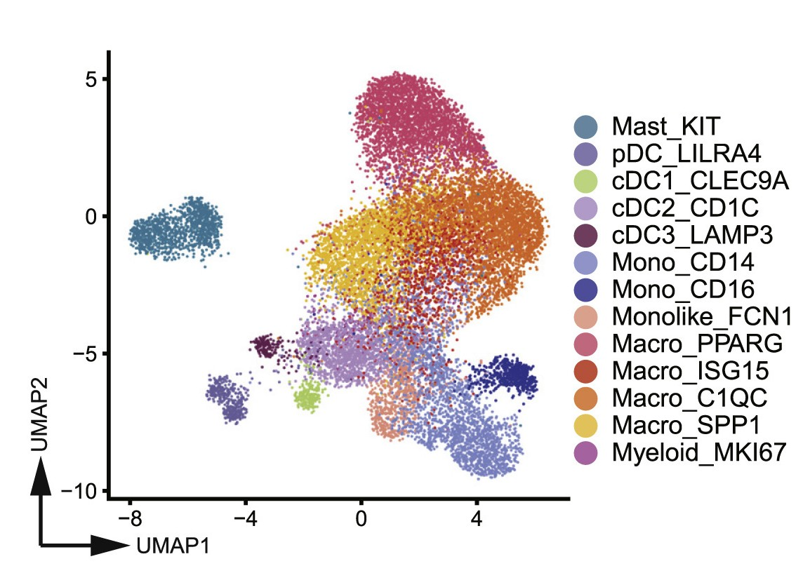

# babel

## Source

Figure 1G from *A pan-cancer single-cell transcriptional atlas of tumor infiltrating myeloid cells* (Cell, 2021). A UMAP embedding of myeloid cell populations across multiple cancer types — macrophages, monocytes, dendritic cells, and beyond.

Every dot is a cell. Every color is a voice. No two speak the same language.

Positions 1–13 follow the legend order of the source figure. Positions 14–21 are the remaining colors from the same figure, appended so the palette covers all clusters rather than stopping at the legend.

## Palette

| # | HEX | Reference label |
|---|---|---|
| 1 | `#1688A7` | Mast_KIT |
| 2 | `#7673AE` | pDC_LILRA4 |
| 3 | `#B3DE69` | cDC1_CLEC9A |
| 4 | `#D195F6` | cDC2_CD1C |
| 5 | `#7E285E` | cDC3_LAMP3 |
| 6 | `#8197FF` | Mono_CD14 |
| 7 | `#0911E9` | Mono_CD16 |
| 8 | `#FF9E81` | Monolike_FCN1 |
| 9 | `#EF5276` | Macro_PPARG |
| 10 | `#EB2C1D` | Macro_ISG15 |
| 11 | `#FD7915` | Macro_C1QC |
| 12 | `#FEC718` | Macro_SPP1 |
| 13 | `#E43EC1` | Myeloid_MKI67 |
| 14 | `#1FDBFE` | Mono_CD14CD16 |
| 15 | `#B1E7E7` | Macro_VCAN |
| 16 | `#B03C0B` | Macro_CX3CR1 |
| 17 | `#F39800` | Macro_FN1 |
| 18 | `#E64B35` | Macro_GPNMB |
| 19 | `#A443B2` | Macro_INHBA |
| 20 | `#FFE4B5` | Macro_IL1B |
| 21 | `#FFF56A` | Macro_NLRP3 |

The "Reference label" column is included only to document the source context.
Users may freely remap the colors to their own cell types or categories.

## Use cases

- Large single-cell UMAP or t-SNE plots with many cell clusters
- Multi-group comparisons requiring many distinct colors
- Any qualitative visualization where categorical separation is the priority
