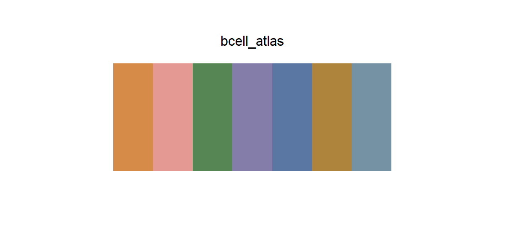

# bcell_atlas

## Source

The palette is reconstructed from the upper-left panel of the graphical abstract for [*Pan-cancer single-cell dissection reveals phenotypically distinct B cell subtypes*](https://www.cell.com/cell/fulltext/S0092-8674(24)00712-8), published in *Cell* (2024). That panel uses contrasting categorical colors to show the heterogeneity of B cells across cancer types.

The seven colors are selected from solid category wedges and repeated cell-population marks: orange, coral, green, purple, slate blue, ochre, and blue grey. The pale blue panel background, black labels, outlines, and anti-aliased edges are excluded because they are structural rather than categorical colors.

## Palette

| # | HEX | Color |
|---|---|---|
| 1 | `#D68B49` | Orange category |
| 2 | `#E49A93` | Coral category |
| 3 | `#558654` | Green category |
| 4 | `#847DAA` | Purple category |
| 5 | `#5A76A2` | Slate-blue category |
| 6 | `#AE843C` | Ochre category |
| 7 | `#7591A4` | Blue-grey category |

## Use cases

- Categorical scatter plots, grouped lines, dot plots, and small-multiple annotations with four to seven groups.
- Cell-type, cancer-type, or treatment-group comparisons where category colors need to remain distinct without becoming fluorescent.
- Use labels or direct annotation when categories exceed seven or when adjacent colors must be distinguished at small sizes.
