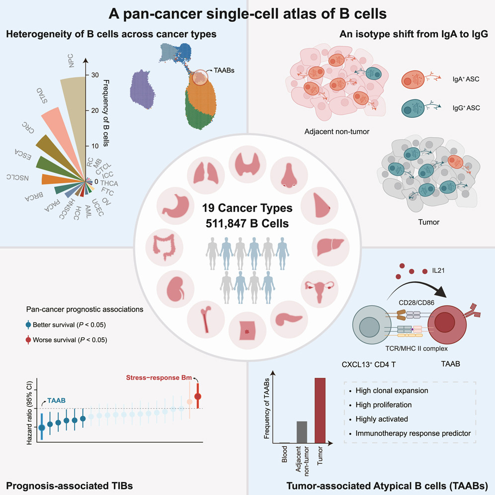
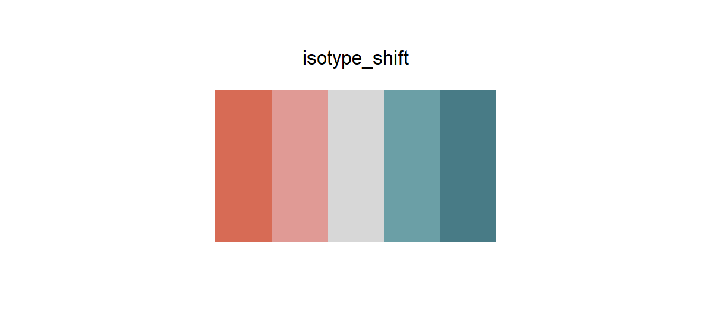

# bcell_atlas2

## Source

The palette is reconstructed from the upper-right panel of the graphical abstract for [*Pan-cancer single-cell dissection reveals phenotypically distinct B cell subtypes*](https://www.cell.com/cell/fulltext/S0092-8674(24)00712-8), published in *Cell* (2024). The panel presents an isotype shift from IgA to IgG, using a warm coral endpoint for IgA-associated cells and a cool teal endpoint for IgG-associated cells.

The five colors preserve that directional contrast: coral, pale coral, neutral grey, pale teal, and deep teal. Very pale cell fills, black outlines, and annotation colors are excluded. The neutral midpoint is reconstructed as a readable light grey so the palette can encode signed change rather than merely reproduce two categorical endpoints.

## Palette

| # | HEX | Color |
|---|---|---|
| 1 | `#D76B55` | IgA coral |
| 2 | `#E09A95` | Light coral |
| 3 | `#D7D7D7` | Neutral midpoint |
| 4 | `#6B9FA6` | Light teal |
| 5 | `#487B86` | IgG teal |

## Use cases

- Diverging heatmaps, signed effect sizes, fold-change summaries, and trajectories with a meaningful neutral midpoint.
- Comparisons where warm and cool ends represent two biological states, such as IgA-like versus IgG-like isotype direction.
- Keep the midpoint visibly neutral and avoid using the palette for unordered categories; for a two-group comparison without direction, use a qualitative palette instead.
