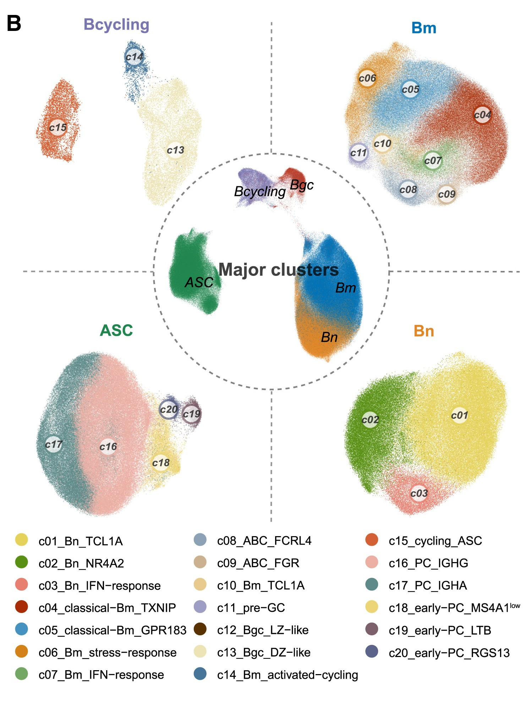
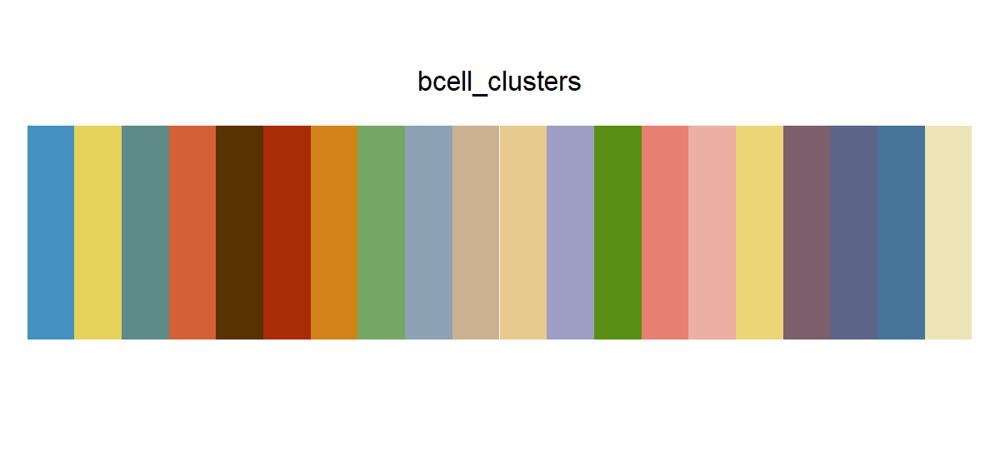

# bcell_clusters

## Source

The palette is reconstructed from the bottom legend of Figure 1B in [*Pan-cancer single-cell dissection reveals phenotypically distinct B cell subtypes*](https://doi.org/10.1016/j.cell.2024.06.038), published in *Cell* (2024). Figure 1B summarizes twenty B-cell clusters across the major B-cell groups shown in the study.

The twenty colors are sampled from the solid legend swatches. The published order puts representative colors from the major Bm, Bn, ASC, cycling, and GC groups first, so taking the first few colors remains useful for compact categorical plots; the remaining subtypes follow by group. The white background, black text, dashed separators, point-cloud shading, and label circles are excluded because they are structural or annotation elements rather than category colors.

## Palette

| # | HEX | Color |
|---|---|---|
| 1 | `#4592C0` | c05_classical–Bm_GPR183 |
| 2 | `#E5D25A` | c01_Bn_TCL1A |
| 3 | `#5E8A89` | c17_PC_IGHA |
| 4 | `#D46135` | c15_cycling_ASC |
| 5 | `#583201` | c12_Bgc_LZ-like |
| 6 | `#A82C06` | c04_classical–Bm_TXNIP |
| 7 | `#D38219` | c06_Bm_stress-response |
| 8 | `#74A764` | c07_Bm_IFN-response |
| 9 | `#8DA2B5` | c08_ABC_FCRL4 |
| 10 | `#CBB190` | c09_ABC_FGR |
| 11 | `#E8CA8E` | c10_Bm_TCL1A |
| 12 | `#9E9EC4` | c11_pre-GC |
| 13 | `#598F13` | c02_Bn_NR4A2 |
| 14 | `#E78071` | c03_Bn_IFN-response |
| 15 | `#EBAFA4` | c16_PC_IGHG |
| 16 | `#ECD577` | c18_early–PC_MS4A1^low |
| 17 | `#7C606C` | c19_early–PC_LTB |
| 18 | `#5C6489` | c20_early–PC_RGS13 |
| 19 | `#477599` | c14_Bm_activated-cycling |
| 20 | `#ECE4B6` | c13_Bgc_DZ-like |

## Use cases

- Categorical scatter plots, dot plots, heatmaps, and small multiples with many labeled groups.
- Cluster, cell-state, cancer-type, or treatment-group comparisons where the category identity is carried by labels or position as well as hue.
- Pair with direct labels, legends, or faceting when colors are shown at small sizes; twenty hues are not intended to imply an ordered or continuous scale.
