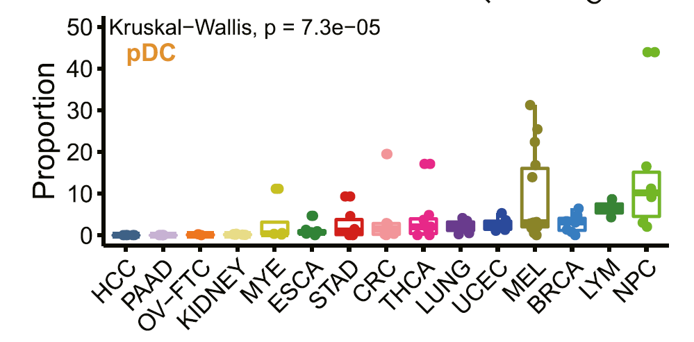
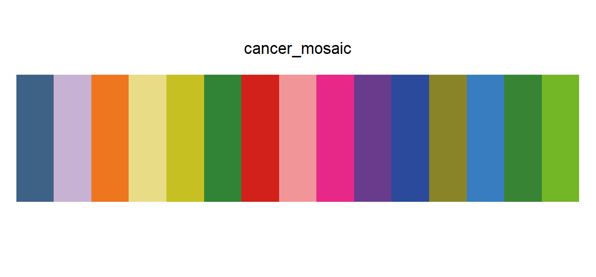

# cancer_mosaic

## Source

Figure 2B from *A pan-cancer single-cell transcriptional atlas of tumor infiltrating myeloid cells* (Cheng et al., *Cell*, 2021; [doi:10.1016/j.cell.2021.01.010](https://doi.org/10.1016/j.cell.2021.01.010)). The panel compares the proportion of plasmacytoid dendritic cells across 15 cancer types.

The colors encode cancer type, not pDC identity or proportion. Together they form a categorical mosaic across the pan-cancer cohort: cool blue and lavender, orange and yellow, greens, reds, pinks, and purples. Each HEX is the repeated flat stroke and point color used for its category, read from left to right along the x-axis.

## Palette

| # | HEX | Reference label |
|---|---|---|
| 1 | `#3E6186` | HCC |
| 2 | `#C7B2D3` | PAAD |
| 3 | `#EE761F` | OV-FTC |
| 4 | `#E8DC87` | KIDNEY |
| 5 | `#C7C022` | MYE |
| 6 | `#318336` | ESCA |
| 7 | `#D2201A` | STAD |
| 8 | `#F29599` | CRC |
| 9 | `#E72888` | THCA |
| 10 | `#693B8D` | LUNG |
| 11 | `#2B4A9B` | LUCEC |
| 12 | `#8A8428` | MEL |
| 13 | `#377DC0` | BRCA |
| 14 | `#388435` | LYM |
| 15 | `#73B626` | NPC |

## Use cases

- Pan-cancer cohort summaries and multi-cancer comparison plots
- Categorical box plots, dot plots, annotation tracks, and faceted figures
- Ten-to-fifteen-group figures where position and labels also support identification

Several colors intentionally occupy nearby families: ESCA and LYM are both green, MYE and MEL are both olive, and LUCEC and BRCA are both blue. The source figure separates them with x-axis position and labels. Do the same in dense figures rather than asking color alone to identify all 15 groups.
