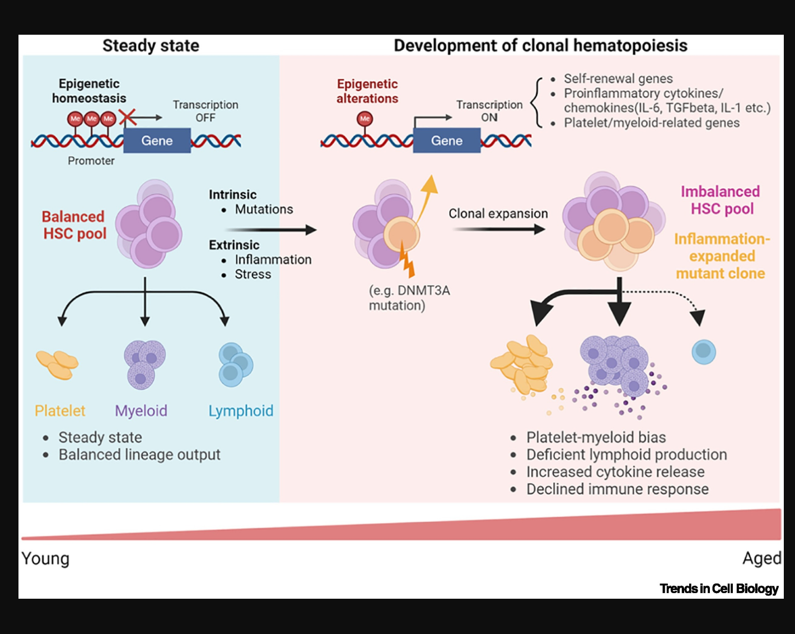
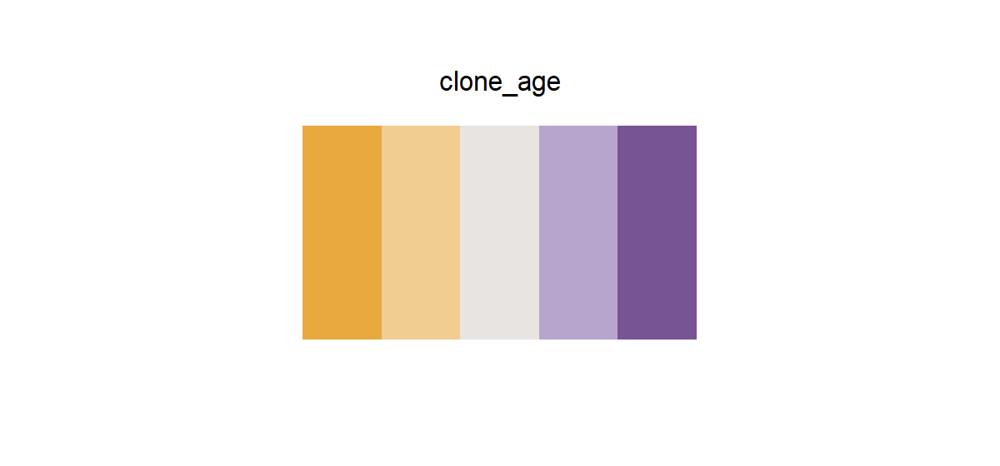

# clone_age

## Source

Figure 4 from Meng and Nerlov, [*Epigenetic regulation of hematopoietic stem cell fate*](https://doi.org/10.1016/j.tcb.2024.08.005) (*Trends in Cell Biology*, 2025). The figure contrasts steady-state hematopoiesis with the development of clonal hematopoiesis across age.

The yellow-orange mutant-clone colors and purple HSC/myeloid colors were reconstructed as two balanced arms around a quiet warm-gray midpoint. The endpoints preserve the source figure's lineage identity; intermediate colors were adjusted for more even perceptual steps in heatmaps and continuous scales. Pale blue and pink panel washes, red annotations, and the separate lymphoid blue were excluded.

## Palette

| # | HEX | Reference label |
|---|---|---|
| 1 | `#E8A93F` | Inflammation-expanded mutant clone — strong |
| 2 | `#F2CD91` | Inflammation-expanded mutant clone — light |
| 3 | `#E7E4E1` | Neutral midpoint |
| 4 | `#B7A5CD` | HSC / myeloid pool — light |
| 5 | `#775493` | HSC / myeloid pool — strong |

## Use cases

- Age-related or state-transition contrasts with a meaningful neutral center
- Diverging heatmaps, signed effect sizes, enrichment scores, and change-from-baseline plots
- Two-sided comparisons where yellow-orange and purple retain distinct biological identities
- The midpoint is intentionally visible on white, but still benefits from cell borders in very small heatmap tiles
