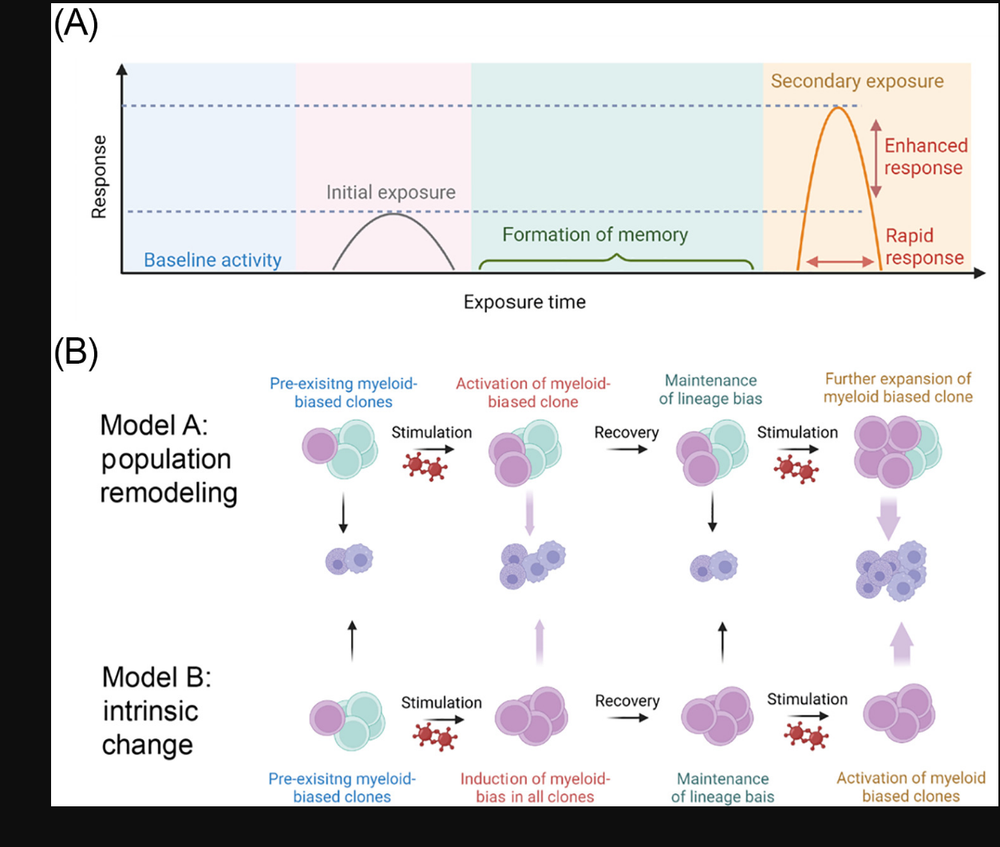
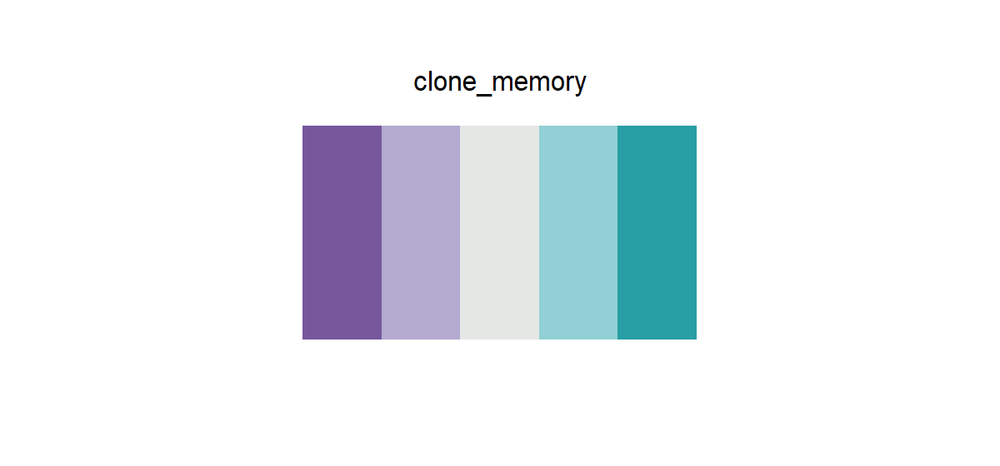

# clone_memory

## Source

Figure 5 from Meng and Nerlov, [*Epigenetic regulation of hematopoietic stem cell fate*](https://doi.org/10.1016/j.tcb.2024.08.005) (*Trends in Cell Biology*, 2025). Its population-remodeling and intrinsic-change models repeatedly contrast purple and cyan clone states during stimulation, recovery, and memory.

The two cellular hues were rebuilt into a compact purple-to-cyan diverging scale. A slightly green neutral gray separates the arms without introducing a conspicuous third hue; the light intermediates preserve the soft illustrative character of the source while keeping adjacent steps usable in dense plots. Red stimulation icons, lavender arrows, and background time bands were excluded.

## Palette

| # | HEX | Reference label |
|---|---|---|
| 1 | `#76579C` | Activated myeloid-biased clone — strong |
| 2 | `#B4AAD0` | Activated myeloid-biased clone — light |
| 3 | `#E5E7E5` | Neutral midpoint |
| 4 | `#91D0D4` | Pre-existing clone — light |
| 5 | `#279FA5` | Pre-existing clone — strong |

## Use cases

- Before/after stimulation, recovery, memory, and clone-state comparisons
- Diverging heatmaps, centered scores, paired changes, and two-condition spatial maps
- Cool-toned figures where red–green or red–blue divergence would dominate the surrounding design
- Purple and cyan remain hue-distinct under compression; use outlines when the pale steps appear as tiny marks
