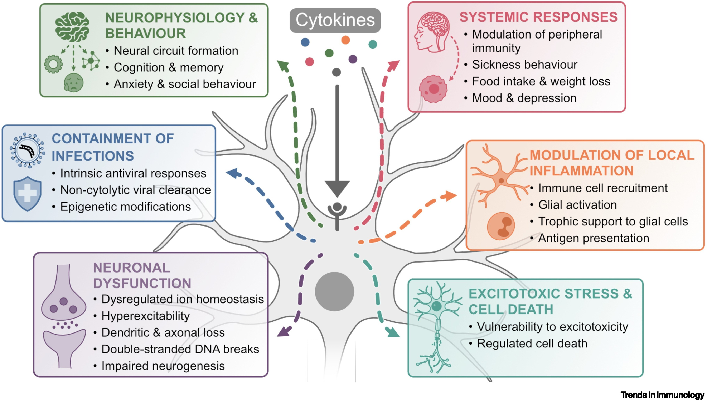
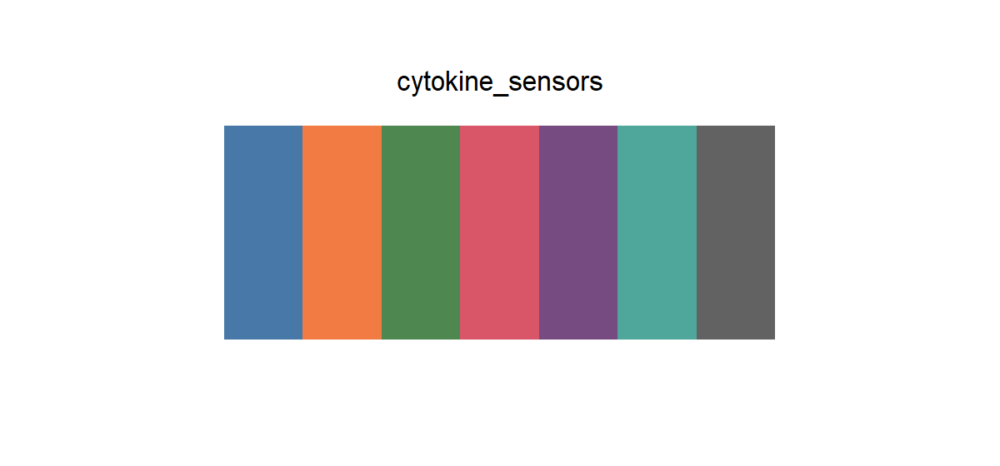

# cytokine_sensors

## Source

Figure 1 from Kahn et al., [*Neurons as cytokine sensors in the central nervous system*](https://doi.org/10.1016/j.it.2026.07.012) (*Trends in Immunology*, 2026). The figure places cytokine input at the center of a neuron and routes it toward six physiological or pathological outcomes.

Six colors were sampled from the solid cytokine dots and repeated dashed paths: infection blue, local-inflammation orange, neurophysiology green, systemic-response red, neuronal-dysfunction purple, and excitotoxic-stress teal. The neutral gray cytokine input completes the set. Pale panel washes, black text, light-gray neuronal anatomy, and translucent icon fills were excluded because they function as background or structure.

## Palette

| # | HEX | Reference label |
|---|---|---|
| 1 | `#4778A8` | Containment of infections |
| 2 | `#F17B43` | Modulation of local inflammation |
| 3 | `#4F8750` | Neurophysiology & behaviour |
| 4 | `#D85668` | Systemic responses |
| 5 | `#754B82` | Neuronal dysfunction |
| 6 | `#4FA69A` | Excitotoxic stress & cell death |
| 7 | `#626262` | Cytokines |

## Use cases

- Six biological outcomes plus one neutral reference, baseline, or shared input
- Pathway diagrams, grouped bars, dot plots, network modules, and annotated heatmaps
- The gray member works best as an intentional control or hub rather than a seventh peer category
- Green and teal need outlines, direct labels, or spatial separation in very small marks
