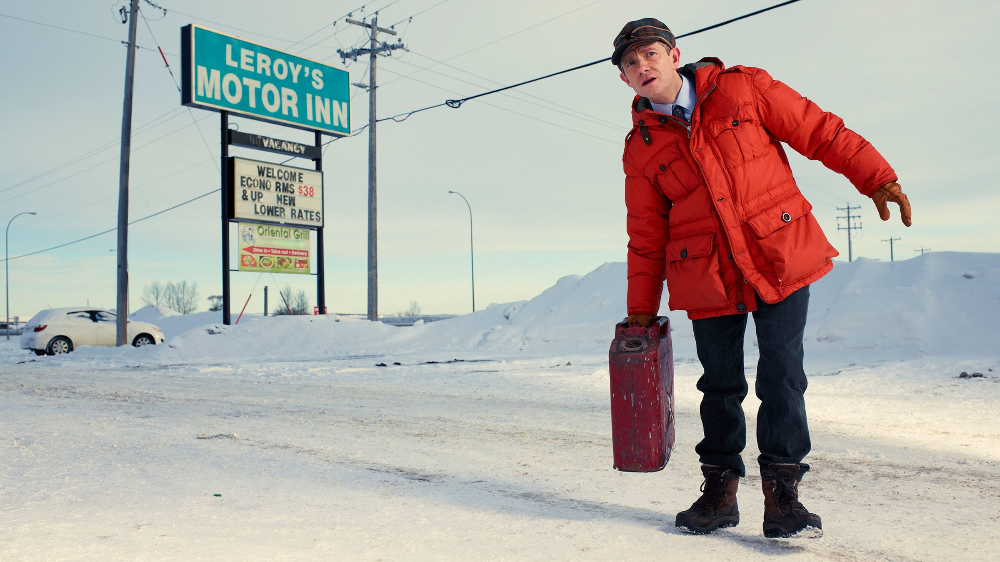

# fargo

## Source

A publicity still from the first season of FX's *Fargo*, with Lester Nygaard stranded in a snowbound roadside composition beside the Leroy's Motor Inn sign.

The palette keeps three compact accents that carry the image's dry, off-kilter balance: the near-black navy of Lester's trousers, the sign's weathered teal, and the softened wine red of the old suitcase. The brighter red parka was deliberately excluded because it overwhelms the other two colors in charts; the snow and pale sky were also left out because they work as atmosphere and background rather than categorical marks.

## Palette

| # | HEX | Color |
|---|---|---|
| 1 | `#14253A` | Midnight navy |
| 2 | `#078B8D` | Motel-sign teal |
| 3 | `#9B3546` | Suitcase wine |

## Use cases

- Three-group comparisons in scatterplots, line charts, and compact legends
- Categorical figures that need a dark anchor, a cool midtone, and one restrained warm accent
- Best on light or warm-white backgrounds; the navy can lose detail against dark panels
- Do not rely on hue alone for small marks or accessibility-critical comparisons; add shape, labels, or direct annotation
