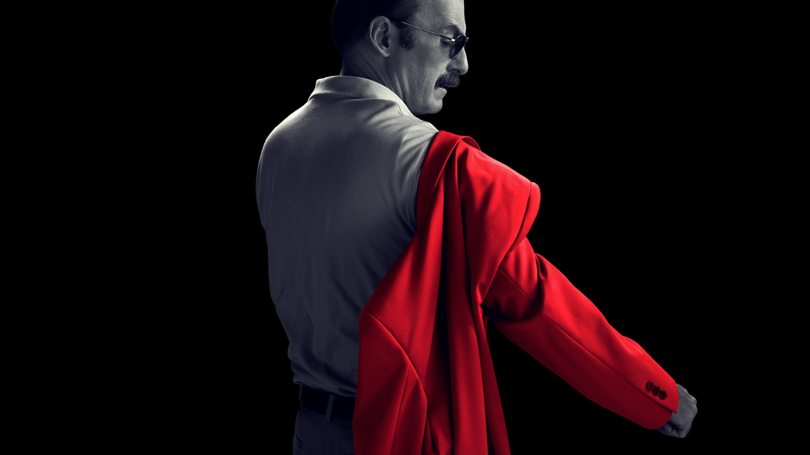
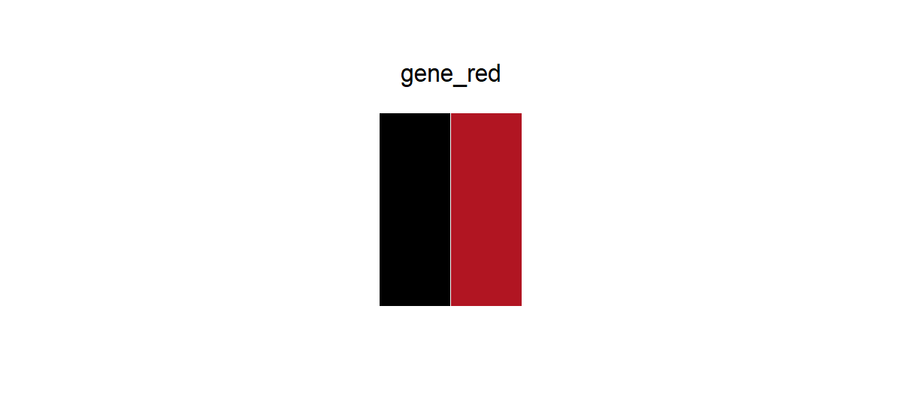

# gene_red

## Source

Poster from *Better Call Saul* — the world's second best lawyer, perhaps, but undeniably the world's best TV series, so it gets to go first.

Meet Gene Takavic: a perfectly ordinary man running a Cinnabon in Omaha, helping elderly folks with their wheelchairs, keeping his head down, and doing absolutely nothing wrong. Nothing to see here. "So after all that? A happy ending."

And yet — one red coat. The only signal in an otherwise black-and-white world.

## Palette

| # | HEX | Color |
|---|---|---|
| 1 | `#000000` | Black |
| 2 | `#B11522` | Crimson red |

## Use cases

- Binary contrasts: up/down, positive/negative, treatment/control
- Highlighting a single signal against a dark or neutral background
