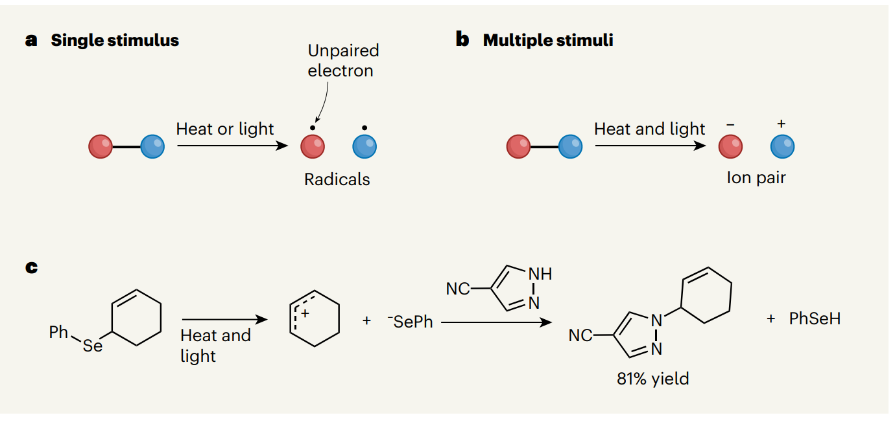
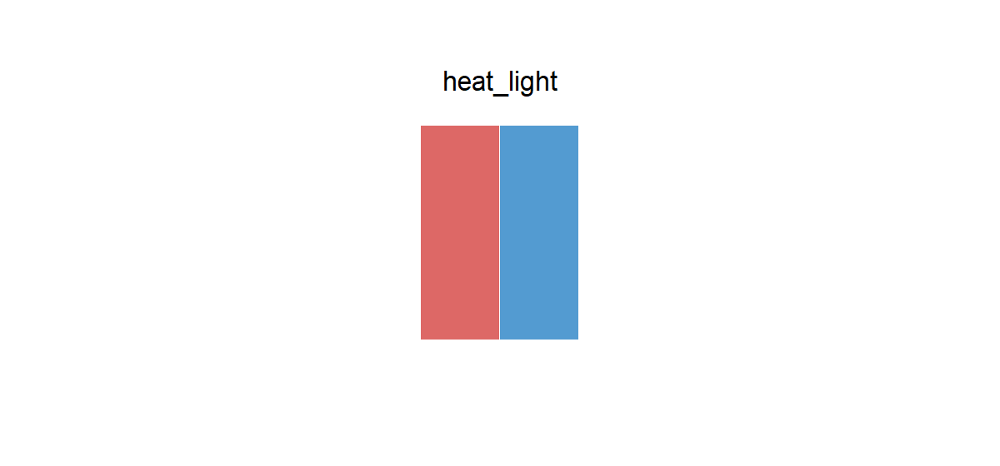

# heat_light

## Source

Figure 1 from *An unconventional way to break chemical bonds* (Sayre & Bhatia, *Nature*, 2024; [doi:10.1038/d41586-024-02437-y](https://doi.org/10.1038/d41586-024-02437-y)). The News & Views article illustrates the work reported by Tiefel et al. in *Unimolecular net heterolysis of symmetric and homopolar σ-bonds* ([doi:10.1038/s41586-024-07622-7](https://doi.org/10.1038/s41586-024-07622-7)).

Across the figure, a red and a blue atom stay visually paired while heat and light change what lies between them: a bond becomes two radicals, then an ion pair. The palette keeps those two recurring identities rather than the warm paper background, black notation, highlights, or shaded edges.

The HEX values are clean samples from the flat interiors of the red and blue atoms. Their order follows the left-to-right order repeated in the figure.

## Palette

| # | HEX | Reference area |
|---|---|---|
| 1 | `#DD6866` | Red atom |
| 2 | `#539BD1` | Blue atom |

The reference-area labels record the source. They do not assign fixed meanings to the colors in another dataset.

## Use cases

- Treatment and control, exposed and unexposed, or two experimental conditions
- Paired categories that should remain related without looking identical
- Two-series points, lines, bars, or diagram nodes on a light background

The two colors have fairly similar visual lightness. For small marks, grayscale reproduction, or accessibility-critical comparisons, reinforce the distinction with point shape, line type, direct labels, or another non-color cue.
