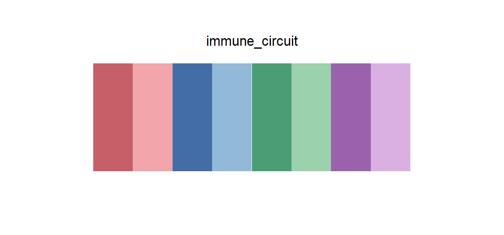

# immune_circuit

## Source

The graphical abstract from Suh et al., [*A logic-gated synthetic circuit coupled with microenvironmental reprogramming overcomes immune exclusion in antigen-poor chondrosarcoma*](https://doi.org/10.1016/j.tibtech.2026.08.008) (*Trends in Biotechnology*, 2026). It summarizes an AND-gated surface T-cell engager paired with MIF blockade to convert an immune-excluded tumor microenvironment into an antitumor response.

Four recurring biological motifs supply paired dark and light colors: tumor/cytotoxicity red, MIF and regulatory-T-cell blue, T-cell green, and M2-macrophage purple. The order keeps each pair adjacent. Near-white tissue washes, black typography, orange circuit arrows, antibody beige, and translucent gradients were excluded because they serve as background or annotation rather than reusable categorical marks.

## Palette

| # | HEX | Reference label |
|---|---|---|
| 1 | `#C65F68` | Tumor — dark |
| 2 | `#F2A5AA` | Tumor — light |
| 3 | `#426DA6` | MIF — dark |
| 4 | `#91B9D8` | Regulatory T cell — light |
| 5 | `#4A9D75` | T cell — dark |
| 6 | `#9BD1AD` | T cell — light |
| 7 | `#9A62AD` | M2 macrophage — dark |
| 8 | `#DAB0E3` | M2 macrophage — light |

## Use cases

- Four parent groups with two paired conditions, states, or time points per group
- Grouped bars, paired dot plots, pathway tracks, and annotated heatmaps where adjacency communicates the pair structure
- Use direct labels or a second channel when all eight colors represent unrelated categories; the within-hue pairs are intentionally associated
- The light members need a light-gray outline for very small marks on white backgrounds
