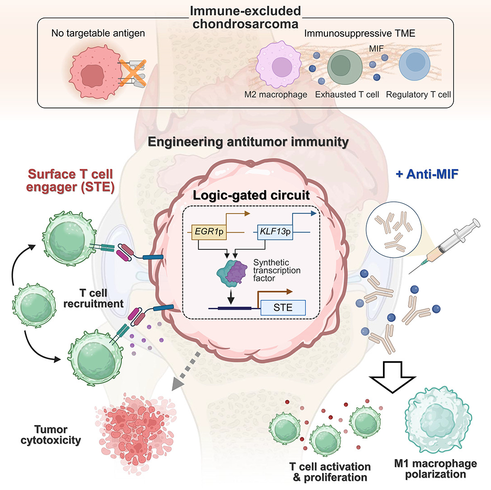
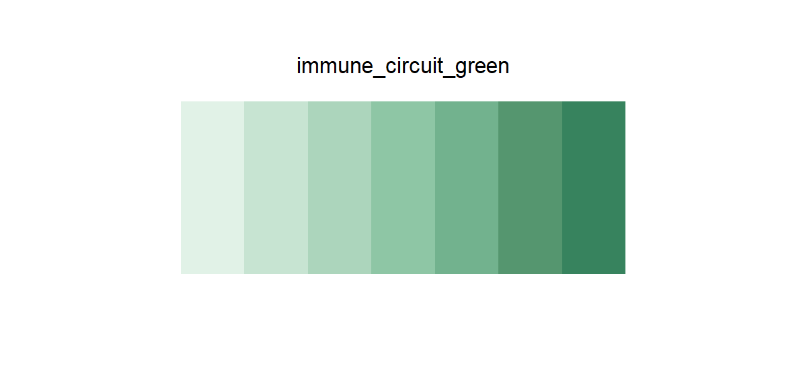

# immune_circuit_green

## Source

The graphical abstract from Suh et al., [*A logic-gated synthetic circuit coupled with microenvironmental reprogramming overcomes immune exclusion in antigen-poor chondrosarcoma*](https://doi.org/10.1016/j.tibtech.2026.08.008) (*Trends in Biotechnology*, 2026). Its green family follows recruited and proliferating T cells through repeated membranes, fills, and darker structural accents.

Seven steps retain the illustration's mint character while forming a usable light-to-dark sequence. White highlights, translucent halos, teal receptor strokes, and the separate cyan M1-macrophage motif were excluded to keep hue progression stable.

## Palette

| # | HEX | Reference label |
|---|---|---|
| 1 | `#E1F2E7` | T cell activation — 1 |
| 2 | `#C7E4D2` | T cell activation — 2 |
| 3 | `#ACD5BC` | T cell activation — 3 |
| 4 | `#8EC6A5` | T cell activation — 4 |
| 5 | `#72B28E` | T cell activation — 5 |
| 6 | `#55966F` | T cell activation — 6 |
| 7 | `#37835E` | T cell activation — 7 |

## Use cases

- T-cell activation, infiltration, proliferation, recovery, or other increasing beneficial signals
- Sequential heatmaps, spatial intensity maps, contours, and ordered effect summaries
- The palest steps are deliberately quiet and need adequate area or an outline against white
