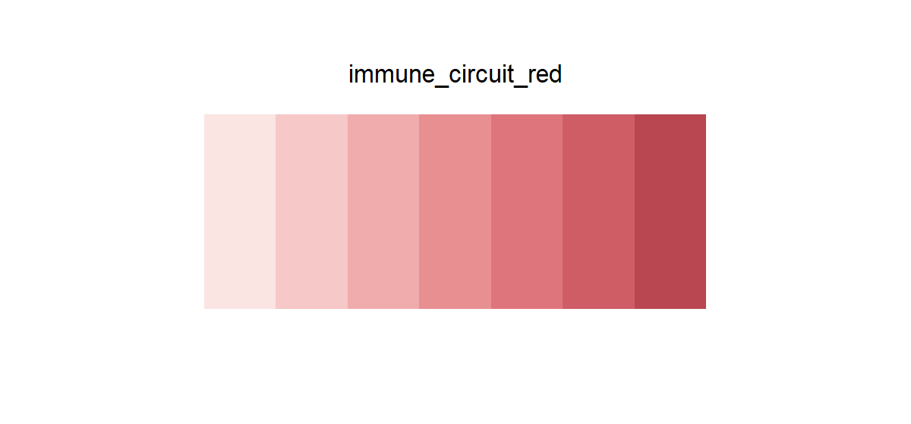

# immune_circuit_red

## Source

The graphical abstract from Suh et al., [*A logic-gated synthetic circuit coupled with microenvironmental reprogramming overcomes immune exclusion in antigen-poor chondrosarcoma*](https://doi.org/10.1016/j.tibtech.2026.08.008) (*Trends in Biotechnology*, 2026). The red family is concentrated in the tumor cell, its membrane, and the cytotoxic tumor debris.

Seven steps reconstruct the figure's soft coral progression from pale cellular fill to the darkest solid tumor accent. Pure white highlights, transparent glow, black outlines, and the unrelated red typography were excluded so the scale remains chromatic and monotonic rather than turning into an annotation palette.

## Palette

| # | HEX | Reference label |
|---|---|---|
| 1 | `#FBE5E3` | Tumor cytotoxicity — 1 |
| 2 | `#F6C8C7` | Tumor cytotoxicity — 2 |
| 3 | `#F0ACAC` | Tumor cytotoxicity — 3 |
| 4 | `#E88F92` | Tumor cytotoxicity — 4 |
| 5 | `#DE757C` | Tumor cytotoxicity — 5 |
| 6 | `#CE5D66` | Tumor cytotoxicity — 6 |
| 7 | `#B94751` | Tumor cytotoxicity — 7 |

## Use cases

- Tumor burden, cytotoxicity, risk, damage, or increasing response magnitude
- Sequential heatmaps, choropleths, density bands, and ordered point estimates on light backgrounds
- The two palest steps require sufficiently large marks or a subtle border on white
