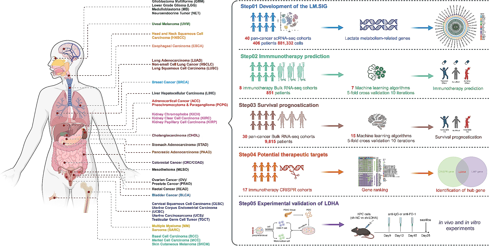
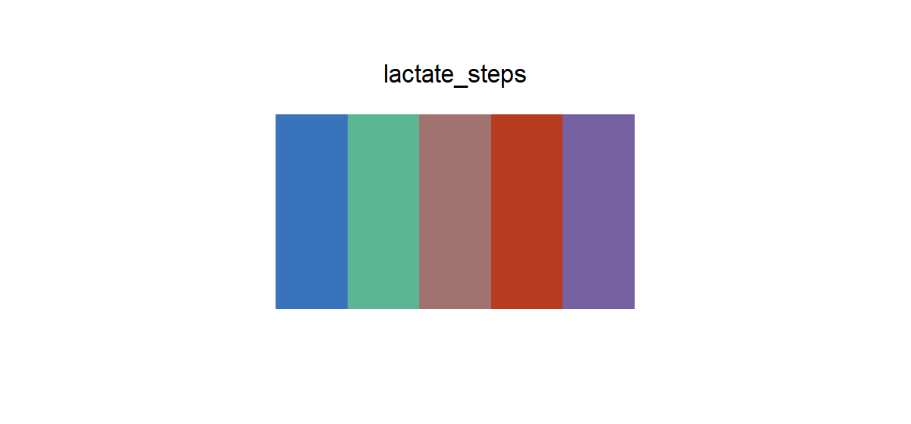

# lactate_steps

## Source

Figure 1 from *Pan-cancer analysis implicates novel insights of lactate metabolism into immunotherapy response prediction and survival prognostication* (Chen et al., *Journal of Experimental & Clinical Cancer Research*, 2024; [doi:10.1186/s13046-024-03042-7](https://doi.org/10.1186/s13046-024-03042-7)).

The study moves through five color-coded stages: development of a lactate-metabolism signature, immunotherapy prediction, survival prognostication, therapeutic-target discovery, and experimental validation of LDHA. Blue, green, brown, orange-red, and purple hold those stages together across headings, people, arrows, and diagrams.

Each HEX comes from the solid interior of its step heading. Dark text outlines, arrow gradients, shared red number highlights, black dividers, and colors inside the small analytical diagrams are not part of the palette.

## Palette

| # | HEX | Reference stage |
|---|---|---|
| 1 | `#3973BC` | Development of the LM.SIG |
| 2 | `#5BB693` | Immunotherapy prediction |
| 3 | `#A17370` | Survival prognostication |
| 4 | `#B63B20` | Potential therapeutic targets |
| 5 | `#7561A2` | Experimental validation of LDHA |

## Use cases

- Five-stage study designs, analysis plans, and graphical abstracts
- Discrete workflow sections, milestone diagrams, and faceted headings
- Five-group comparisons that need a restrained scientific-figure palette

The source uses these colors for ordered steps, but the colors themselves do not form a monotonic lightness scale. Keep them discrete: do not interpolate them as a sequential gradient. The brown and orange-red are the closest pair; direct labels remain useful in small marks.
