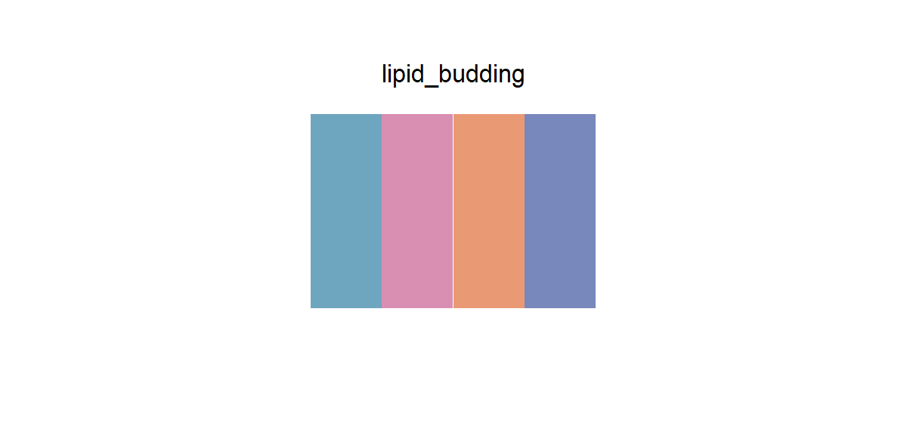

# lipid_budding

## Source

Figure 5A from Artico et al., [*Endoplasmic reticulum architecture in liver metabolic regulation*](https://doi.org/10.1016/j.tcb.2026.03.004) (*Trends in Cell Biology*, 2026). The panel traces triacylglycerol nucleation and lipid-droplet budding from curved hepatic ER tubules.

The four colors were sampled from the principal fills of the labeled membrane proteins DGAT2, DGAT1, Seipin, and FIT2, following their left-to-right narrative order. Specular highlights and dark outlines were averaged into reusable midtones. The pale ER lumen, neutral membrane lipids, orange TAG symbols, red arrows, black typography, and liver inset were excluded because they function as structure, annotation, or a separate outcome rather than peer categories.

## Palette

| # | HEX | Reference label |
|---|---|---|
| 1 | `#6FA6BF` | DGAT2 |
| 2 | `#D98FB1` | DGAT1 |
| 3 | `#E99A74` | Seipin |
| 4 | `#7888BD` | FIT2 |

## Use cases

- Four experimental groups, protein classes, organelle compartments, or pathway branches
- Grouped bars, dot plots, compact pathway diagrams, and four-track annotations
- Keep the source order when a cool–warm–cool cadence helps the legend read cleanly
- DGAT1 rose and Seipin orange benefit from outlines or direct labels in very small marks
