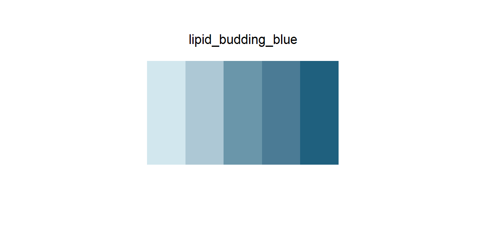

# lipid_budding_blue

## Source

Figure 5A from Artico et al., [*Endoplasmic reticulum architecture in liver metabolic regulation*](https://doi.org/10.1016/j.tcb.2026.03.004) (*Trends in Cell Biology*, 2026). Its blue range is anchored in the gradient-filled DGAT2 protein at the curved ER membrane where triacylglycerol nucleation begins.

Five steel-blue levels reconstruct the protein's highlight-to-shadow progression while widening the tonal spacing for data graphics. The black outline, white reflection, ER lumen wash, and neighboring membrane grays were excluded.

## Palette

| # | HEX | Reference label |
|---|---|---|
| 1 | `#D2E7EE` | DGAT2 tone 1 |
| 2 | `#ADC8D5` | DGAT2 tone 2 |
| 3 | `#6A96AA` | DGAT2 tone 3 |
| 4 | `#4B7B95` | DGAT2 tone 4 |
| 5 | `#1F607E` | DGAT2 tone 5 |

## Use cases

- Expression, abundance, flux, density, or confidence increasing from low to high
- Continuous heatmaps, spatial overlays, filled contours, binned maps, and ordered bars
- Five anchors favor legible discrete bins; continuous scales may interpolate between them
- The lightest tone needs an outline for tiny marks on white backgrounds
