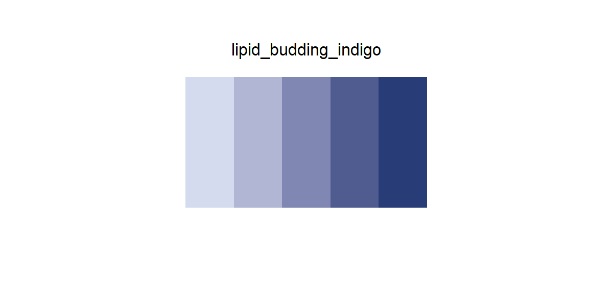

# lipid_budding_indigo

## Source

Figure 5A from Artico et al., [*Endoplasmic reticulum architecture in liver metabolic regulation*](https://doi.org/10.1016/j.tcb.2026.03.004) (*Trends in Cell Biology*, 2026). The slate-indigo progression comes from FIT2 at the right edge of the curved ER tubule.

Five levels translate its lavender highlight and blue-violet shadow into a wider ordered scale. White gloss, black contour lines, pale membrane structure, and the neighboring Seipin orange were not included.

## Palette

| # | HEX | Reference label |
|---|---|---|
| 1 | `#D5DBEE` | FIT2 tone 1 |
| 2 | `#B0B6D4` | FIT2 tone 2 |
| 3 | `#8087B2` | FIT2 tone 3 |
| 4 | `#505B90` | FIT2 tone 4 |
| 5 | `#283C78` | FIT2 tone 5 |

## Use cases

- Ordered scores, expression, density, time, or confidence
- Heatmaps, spatial intensity maps, contours, and binned distributions
- A violet-leaning counterpart to steel-blue sequential scales
- Use direct labels when adjacent steps appear as small isolated marks
