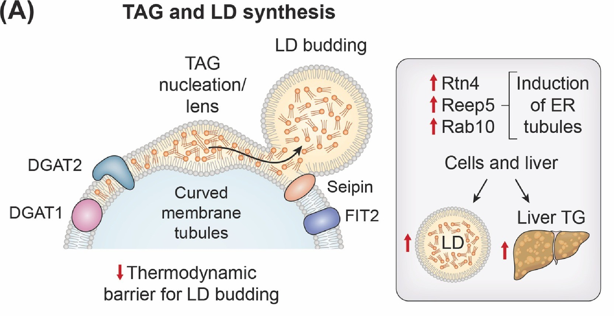
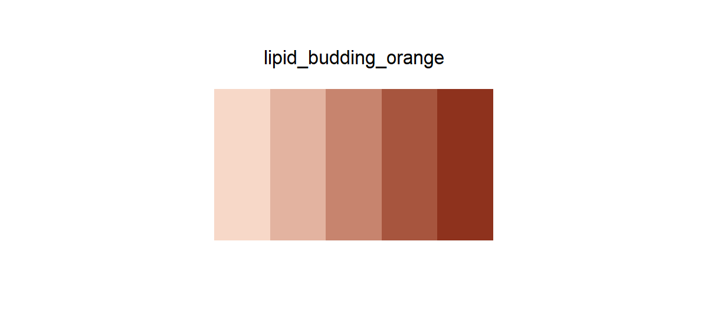

# lipid_budding_orange

## Source

Figure 5A from Artico et al., [*Endoplasmic reticulum architecture in liver metabolic regulation*](https://doi.org/10.1016/j.tcb.2026.03.004) (*Trends in Cell Biology*, 2026). The sequence is based on Seipin's salmon-orange gradient beside the nascent lipid droplet.

Five tones extend the protein fill into an even light-to-dark scale while preserving its muted warmth. The brighter TAG molecules, cream lipid-droplet interior, black outlines, and liver ochres were excluded to keep the hue path coherent.

## Palette

| # | HEX | Reference label |
|---|---|---|
| 1 | `#F7D8C8` | Seipin tone 1 |
| 2 | `#E3B3A0` | Seipin tone 2 |
| 3 | `#C7846E` | Seipin tone 3 |
| 4 | `#A7553E` | Seipin tone 4 |
| 5 | `#8E321D` | Seipin tone 5 |

## Use cases

- Increasing lipid accumulation, activity, exposure, burden, or effect size
- Sequential heatmaps, filled contours, ordered bars, and five-bin summaries
- Warm emphasis without the alarm tone of saturated red
- The first step is intended for areas rather than hairline strokes on white
