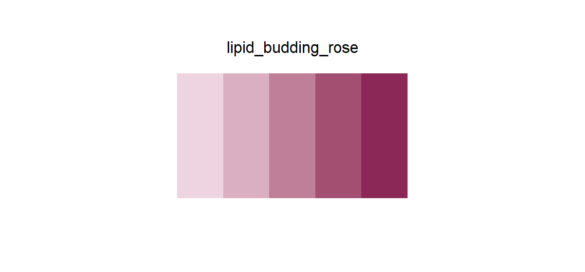

# lipid_budding_rose

## Source

Figure 5A from Artico et al., [*Endoplasmic reticulum architecture in liver metabolic regulation*](https://doi.org/10.1016/j.tcb.2026.03.004) (*Trends in Cell Biology*, 2026). The dusty rose sequence develops the highlight, body, and shadow of DGAT1 on the lower-left ER membrane.

The five steps retain the figure's mauve cast rather than turning into a generic red ramp. White gloss, dark contour strokes, membrane neutrals, and the red directional arrows were excluded.

## Palette

| # | HEX | Reference label |
|---|---|---|
| 1 | `#EED4E1` | DGAT1 tone 1 |
| 2 | `#DBAFC2` | DGAT1 tone 2 |
| 3 | `#BF7F99` | DGAT1 tone 3 |
| 4 | `#A34F72` | DGAT1 tone 4 |
| 5 | `#8C2857` | DGAT1 tone 5 |

## Use cases

- Ordered intensity, enrichment, burden, risk, or response values
- Heatmaps, density surfaces, binned choropleths, and ranked effect displays
- Useful when a softer alternative to conventional red is needed
- Avoid treating neighboring steps as unrelated categories in small unlabelled points
