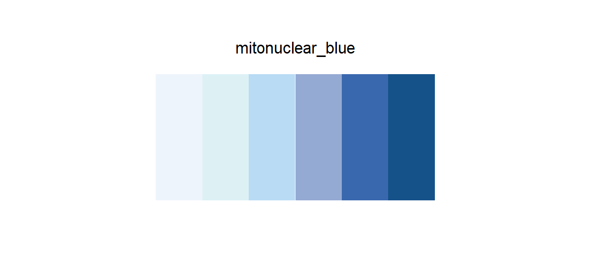

# mitonuclear_blue

## Source

Figure 1 from *Mitochondrial-to-nuclear communication in aging: an epigenetic perspective* (Zhu, Li & Tian, *Trends in Biochemical Sciences*, 2022; [doi:10.1016/j.tibs.2022.03.008](https://doi.org/10.1016/j.tibs.2022.03.008)).

The young state is held in blue: a cool wash behind the mitochondrion and nucleus, then progressively firmer blue accents in their structures. The sequence keeps that direction — from an almost white cellular field to a deep blue anchor.

The six HEX values are clean anchors reconstructed for shades present in the figure, rather than noisy samples from antialiased edges. Their order follows visual lightness from low emphasis to high emphasis.

## Palette

| # | HEX | Reference area |
|---|---|---|
| 1 | `#EEF4FB` | Young highlight |
| 2 | `#DDF1F5` | Young field |
| 3 | `#B9DBF4` | Mitochondrial blue |
| 4 | `#95AAD3` | Young cell blue |
| 5 | `#3A68AE` | Blue structural accent |
| 6 | `#155289` | Deep blue anchor |

The reference-area labels document where the sequence comes from. They do not constrain how the colors are mapped in another dataset.

## Use cases

- Sequential choropleth maps and heatmaps
- Expression, abundance, probability, or other one-direction continuous values
- Ordered bins that need a cool low-to-high progression

Use the colors from light to dark for increasing values. On a white background, keep a thin boundary around the lightest two classes when adjacent regions must remain visible.
