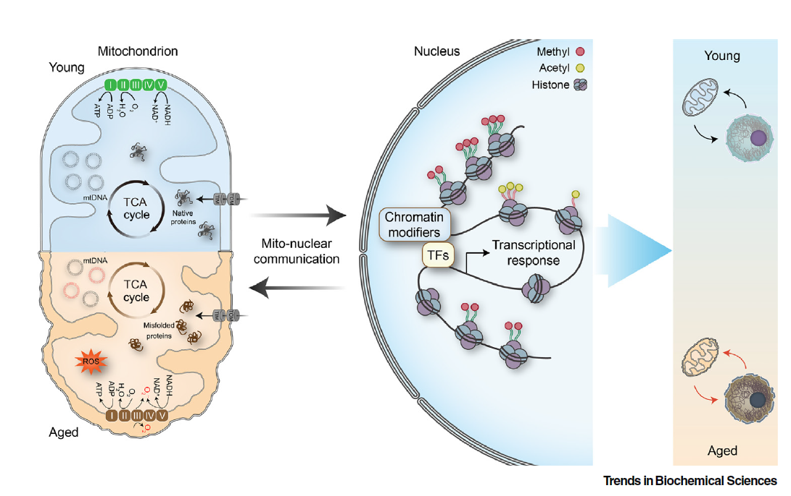
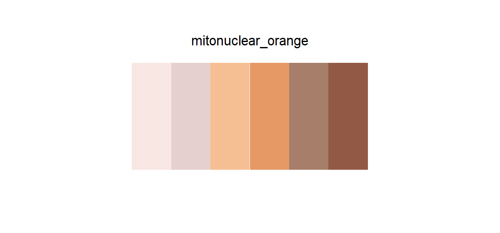

# mitonuclear_orange

## Source

Figure 1 from *Mitochondrial-to-nuclear communication in aging: an epigenetic perspective* (Zhu, Li & Tian, *Trends in Biochemical Sciences*, 2022; [doi:10.1016/j.tibs.2022.03.008](https://doi.org/10.1016/j.tibs.2022.03.008)).

The aged state turns warm: pale tissue pink and cream move through mitochondrial peach into brown structural accents. The sequence preserves that visual logic as a single warm direction rather than pairing it with the young blue as a diverging scale.

The six HEX values are clean anchors reconstructed for shades present in the figure, rather than noisy samples from antialiased edges. Their order follows visual lightness from low emphasis to high emphasis.

## Palette

| # | HEX | Reference area |
|---|---|---|
| 1 | `#F8E7E3` | Aged highlight |
| 2 | `#E5D0CF` | Aged field |
| 3 | `#F6BF93` | Pale mitochondrion |
| 4 | `#E69965` | Aged mitochondrial orange |
| 5 | `#A77E69` | Warm structural accent |
| 6 | `#925A44` | Deep brown anchor |

The reference-area labels document where the sequence comes from. They do not constrain how the colors are mapped in another dataset.

## Use cases

- Sequential choropleth maps and heatmaps in a warm register
- Intensity, burden, duration, or other one-direction continuous values
- Ordered bins that should feel warmer as values increase

Use the colors from light to dark for increasing values. The first two colors are deliberately quiet; retain boundaries or grid lines when they sit on white.
