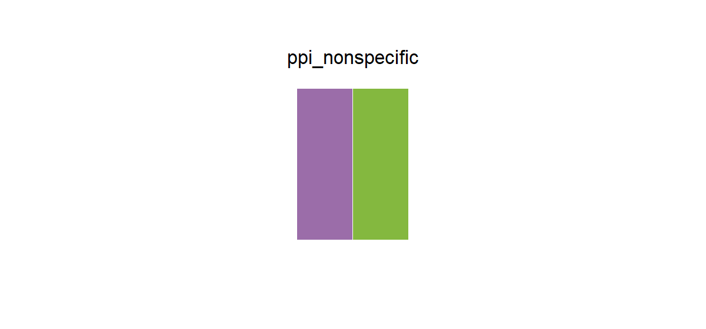

# ppi_nonspecific

## Source

Box 1, Figure 1 from Gainza et al., [*Machine learning to predict de novo protein–protein interactions*](https://doi.org/10.1016/j.tibtech.2025.04.013) (*Trends in Biotechnology*, 2025). The non-specific-interaction panel repeatedly separates and recombines a purple protein with a green protein.

The pair was rebuilt from the solid centers of those molecular surfaces. The green was restrained slightly to balance the visual weight of the darker purple. Surface highlights, shadows, arrows, text, and panel background were not sampled.

## Palette

| # | HEX | Reference label |
|---|---|---|
| 1 | `#9B6DA9` | Non-specific interaction partner — purple |
| 2 | `#84B83F` | Non-specific interaction partner — green |

## Use cases

- Two proteins, conditions, cohorts, or interaction partners
- Paired bars, lines, points, network nodes, and before/after comparisons
- Both colors are mid-tone and remain visible on white; do not treat their order as directional
