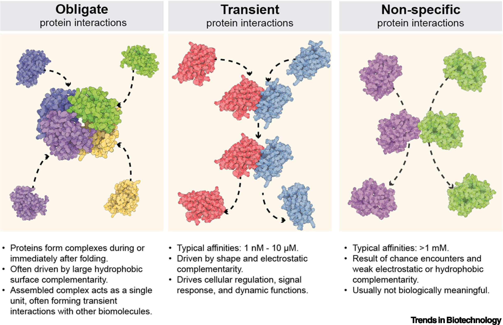
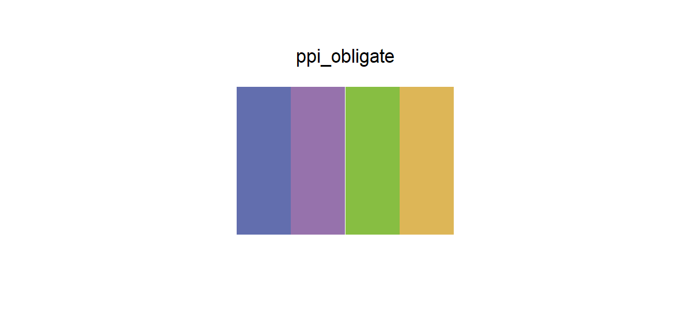

# ppi_obligate

## Source

Box 1, Figure 1 from Gainza et al., [*Machine learning to predict de novo protein–protein interactions*](https://doi.org/10.1016/j.tibtech.2025.04.013) (*Trends in Biotechnology*, 2025). Its obligate-interaction panel assembles four differently colored protein subunits into one stable complex.

The blue-violet, purple, green, and yellow were reconstructed from the four protein surfaces, with brightness moderated so that no member dominates on white. Highlights and shadows within the molecular renderings, dashed arrows, headings, and cream background were excluded.

## Palette

| # | HEX | Reference label |
|---|---|---|
| 1 | `#626EAE` | Obligate subunit — blue-violet |
| 2 | `#9672AC` | Obligate subunit — purple |
| 3 | `#87BE42` | Obligate subunit — green |
| 4 | `#DDB657` | Obligate subunit — yellow |

## Use cases

- Four subunits, domains, components, or members of one assembled system
- Protein-complex diagrams, grouped bars, annotated networks, and pathway modules
- The two purple-family members benefit from outlines or direct labels in tiny adjacent marks
