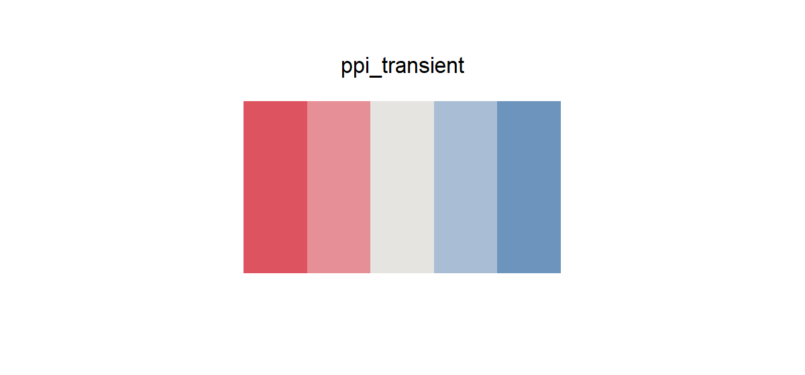

# ppi_transient

## Source

Box 1, Figure 1 from Gainza et al., [*Machine learning to predict de novo protein–protein interactions*](https://doi.org/10.1016/j.tibtech.2025.04.013) (*Trends in Biotechnology*, 2025). The transient-interaction panel shows red and blue proteins associating and separating in a reversible pair.

The two endpoint hues were expanded into a five-step diverging scale around a visible neutral gray. Intermediate colors were designed for even separation in centered quantitative graphics rather than copied from molecular highlights. Dashed arrows, black outlines, headings, and cream background were excluded.

## Palette

| # | HEX | Reference label |
|---|---|---|
| 1 | `#DE5360` | Transient partner / negative extreme — red |
| 2 | `#E78F96` | Red intermediate |
| 3 | `#E5E4E1` | Neutral midpoint |
| 4 | `#A9BED4` | Blue intermediate |
| 5 | `#6D94BC` | Transient partner / positive extreme — blue |

## Use cases

- Centered interaction scores, signed effects, residuals, and correlation matrices
- Diverging heatmaps, spatial maps, and change-from-baseline plots
- The neutral remains visible on white, although borders help in very small cells
