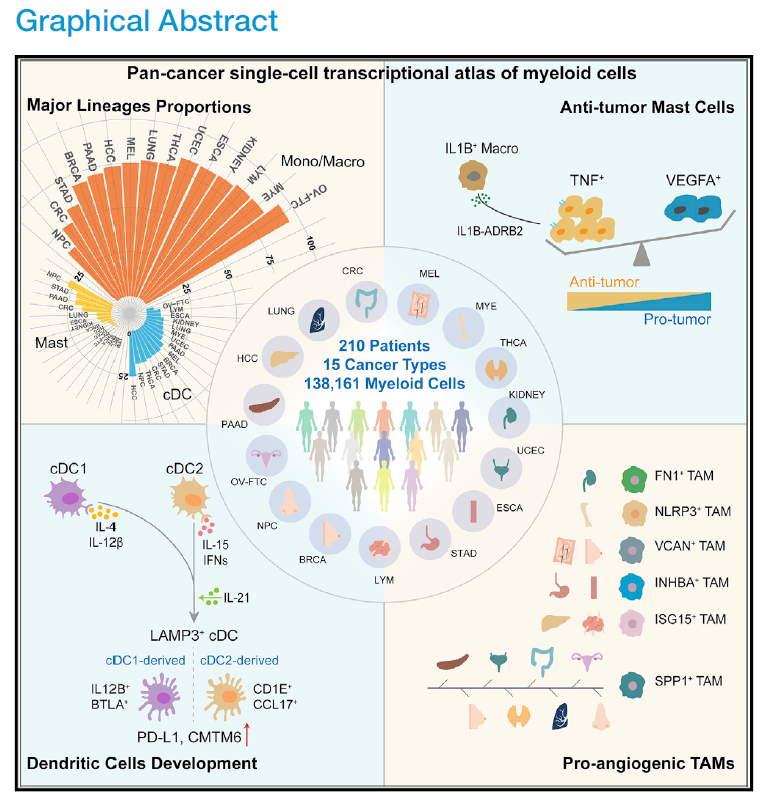
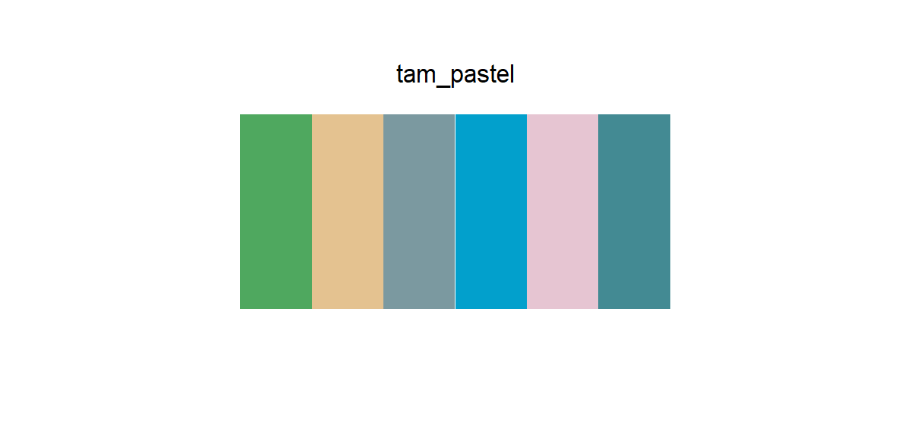

# tam_pastel

## Source

The Graphical Abstract from *A pan-cancer single-cell transcriptional atlas of tumor infiltrating myeloid cells* (Cheng et al., *Cell*, 2021; [doi:10.1016/j.cell.2021.01.010](https://doi.org/10.1016/j.cell.2021.01.010)). The lower-right panel arranges six pro-angiogenic tumor-associated macrophage states as compact, flower-like cell icons.

This palette follows those six icons in legend order. Each HEX is the repeated flat fill of the outer cell body, not the smaller nucleus, antialiased edge, warm page background, or nearby organ illustration. The result keeps the figure's soft scientific-illustration character while preserving one brighter cyan anchor.

## Palette

| # | HEX | Reference label |
|---|---|---|
| 1 | `#4FA85F` | FN1⁺ TAM |
| 2 | `#E4C290` | NLRP3⁺ TAM |
| 3 | `#7B99A0` | VCAN⁺ TAM |
| 4 | `#02A0CC` | INHBA⁺ TAM |
| 5 | `#E6C5D2` | ISG15⁺ TAM |
| 6 | `#438A93` | SPP1⁺ TAM |

The reference labels document the source context. They do not constrain how the colors are mapped in another dataset.

## Use cases

- Four-to-six-group single-cell summaries, annotation bars, and dot plots
- Categorical figures that need a softer alternative to highly saturated cluster colors
- Bars, points, or diagram nodes on white and warm-white backgrounds

The pale sand and pink need enough area to remain visible, especially on white. Use a thin neutral outline for small points or adjacent filled regions. VCAN⁺ and SPP1⁺ are both blue-green, so reinforce them with direct labels or shape when they must be compared in isolation.
