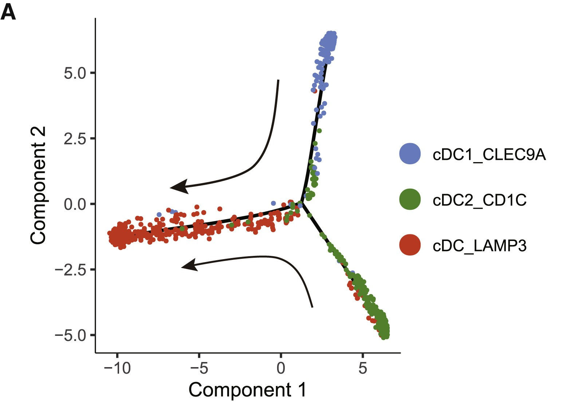

# three_body

## Source

Figure 4A from *A pan-cancer single-cell transcriptional atlas of tumor infiltrating myeloid cells* (Cell, 2021). A trajectory analysis of three dendritic cell subtypes — cDC1, cDC2, and cDC3 — each following a distinct differentiation path within the tumor microenvironment.

Three bodies. Three orbits. No stable solution.

## Palette

| # | HEX | Reference label |
|---|---|---|
| 1 | `#6495ED` | cDC1_CLEC9A |
| 2 | `#339933` | cDC2_CD1C |
| 3 | `#FF4500` | cDC3_LAMP3 |

The "Reference label" column is included only to document the source context.
Users may freely remap the colors to their own cell types or categories.

## Use cases

- Three-group comparisons with strong categorical separation
- Trajectory or pseudotime plots with a small number of lineages
- Any visualization requiring three highly distinct colors
